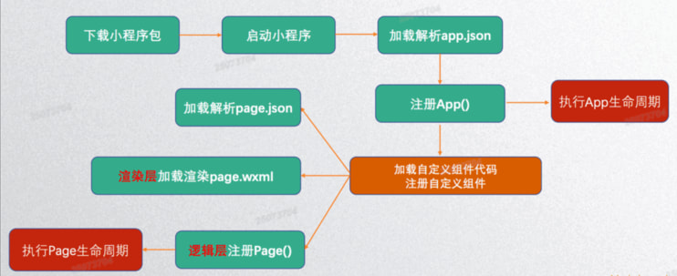

# 微信小程序

## 简介

::: info 小程序特点

- 类似于Web开发模式，入门的门槛低：基本上是类似于html+css+js；
- 可直接云端更新：微信审核，无需经过App Store等平台；
- 提升用户体验：通过提供基础能力、原生组件结合等方式，提升用户体验；
- 平台管控能力：小程序提供云端更新，通过代码上传、审核等方式，增强对开发者的管控能力；
- 双线程模型：逻辑层和渲染层分开加载，提供了管控型和安全性（沙盒环境运行JS代码，不允许执行任何和浏览器相关的接口，比如跳转页面、操作DOM等）；

:::

[微信小程序开发文档](https://developers.weixin.qq.com/miniprogram/dev/framework/release/)

小程序的开发主要分成三部分：

- 页面布局：WXML，类似HTML
- 页面样式：WXSS，几乎就是CSS（某些不支持，某些进行了增强）
- 页面脚本：JavaScript+WXS，（JS，以及WeixinScript后续学习）

### 申请APPID

1. **访问微信公众平台**  
   打开 [微信公众平台](https://mp.weixin.qq.com/)，使用微信扫描二维码登录

2. **选择小程序注册类型**  
   点击"立即注册"，选择"小程序"类型

3. **填写注册信息**  
   邮箱：一个未绑定微信公众平台的邮箱

4. **邮箱激活**  
   登录注册邮箱，点击微信发送的激活链接

5. **信息登记**  
   选择主体类型：个人/企业/政府、媒体、其他组织等

6. **完善小程序信息**  
   小程序名称（需审核）/头像/简介

7. **获取 AppID**  
   注册完成后，在"开发"-"开发管理"-"开发设置"中查看 AppID

::: info AppID的作用

- **开发调试**：在微信开发者工具中配置 AppID 进行开发
- **接口调用**：调用微信 API 需要 AppID 验证身份
- **发布上线**：小程序上线审核需要已认证的 AppID

:::

::: warning ⚠️ 注意

- 个人主体小程序功能有限，很多接口无法使用
- 企业主体小程序需要微信认证（300元/年）
- 小程序名称需符合微信命名规范，不能与已存在的小程序名称重复
- AppID 泄露不会造成安全风险，但建议妥善保管

:::

[微信开发者工具](https://developers.weixin.qq.com/miniprogram/dev/devtools/download.html)

## 架构和配置

### 代码组织结构

小程序代码组织结构分为三个级别：应用级别、页面级别和组件级别。

| 级别         | 文件           | 说明                                             |
| ------------ | -------------- | ------------------------------------------------ |
| **应用级别** | app.js         | 创建 App 实例的代码，包含全局逻辑和生命周期      |
|              | app.json       | 全局配置，如 window、tabbar、页面路由等          |
|              | app.wxss       | 全局样式，对所有页面生效                         |
| **页面级别** | page.js        | 创建 Page 实例的代码，包含页面逻辑和生命周期     |
|              | page.json      | 页面单独配置，如 window 配置、usingComponents 等 |
|              | page.wxml      | 页面的布局代码，类似于 HTML                      |
|              | page.wxss      | 页面样式，类似于 CSS                             |
| **组件级别** | component.js   | 创建 Component 实例的代码，包含组件逻辑          |
|              | component.json | 组件配置，声明依赖的其他组件                     |
|              | component.wxml | 组件的布局代码                                   |
|              | component.wxss | 组件的样式代码                                   |

### 配置文件

::: info 常见的配置文件有哪些呢？

- **project.config.json**：项目配置文件，比如项目名称、appid等；[项目配置文件](https://developers.weixin.qq.com/miniprogram/dev/devtools/projectconfig.html)
- **sitemap.json**：小程序搜索相关的；
- **app.json**：全局配置；
- **page.json**：页面配置；

:::

> [全局配置](https://developers.weixin.qq.com/miniprogram/dev/reference/configuration/app.html)

| 属性       | 类型     | 必填   | 描述               |
| ---------- | -------- | ------ | ------------------ |
| **pages**  | string[] | **是** | 页面路径列表       |
| **window** | Object   | 否     | 全局的默认窗口表现 |
| **tabBar** | Object   | 否     | 底部 tab 栏的表现  |

**1. pages：页面路径列表**

- **作用**：用于指定小程序由哪些页面组成，每一项都对应一个页面的路径（含文件名）信息。
- **注意**：小程序中**所有的页面**都是必须在 `pages` 中进行注册的。

**2. window：全局的默认窗口展示**

- **作用**：用户指定窗口如何展示，其中还包含了很多其他的属性（如导航栏颜色、背景色等）。

**3. tabBar：底部tab栏的展示**

> **页面配置**

- 每一个小程序页面也可以使用 .json 文件来对本页面的窗口表现进行配置。页面中配置项在当前页面会覆盖 app.json 的 window 中相同的配置项。

### 小程序启动流程



::: info 界面渲染整体流程

1. 在渲染层，宿主环境会把**WXML**转化成对应的**JS对象**；
2. 将**JS对象**再次转成**真实DOM树**，交由渲染层线程渲染；
3. 数据变化时，逻辑层提供最新的变化数据，JS对象发生变化比较进行diff算法对比；
4. 将最新变化的内容反映到真实的DOM树中，更新UI；

:::

#### 注册App

- 每个小程序都需要在 app.js 中调用 App 方法。[App 方法](https://developers.weixin.qq.com/miniprogram/dev/reference/api/App.html)
- 在注册时，可以绑定对应的生命周期函数，在生命周期函数中，执行对应的代码。

| 属性           | 类型     | 说明                                                                 |
| -------------- | -------- | -------------------------------------------------------------------- |
| onLaunch       | function | 生命周期回调——监听小程序初始化。                                     |
| onShow         | function | 生命周期回调——监听小程序启动或切前台。                               |
| onHide         | function | 生命周期回调——监听小程序切后台。                                     |
| onError        | function | 错误监听函数。                                                       |
| onPageNotFound | function | 页面不存在监听函数。                                                 |
| 其他           | any      | 开发者可以添加任意的函数或数据变量到 Object 参数中，用 this 可以访问 |

::: info 注册App时常做的操作

1. 判断小程序的**进入场景**
2. 监听**生命周期函数**，在生命周期中执行对应的业务逻辑，比如在某个生命周期函数中获取微信用户的信息
3. 因为App()实例只有一个，并且是**全局共享的**（单例对象），所以我们可以将一些共享数据放在这里。

:::

```js
App({
  // 当小程序初始化完成时，会触发 onLaunch（全局只触发一次）
  onLaunch: function () {
    console.log("小程序初始化完成: onLaunch");
  },
  // 当小程序启动，或从后台进入前台显示，会触发 onShow
  onShow: function (options) {
    console.log("小程序第一次启动，或者从后台进入前台, onShow");
  },
  // 当小程序从前台进入后台，会触发 onHide
  onHide: function () {
    console.log("小程序从前台进入后台, onHide");
  },
  // 当小程序发生脚本错误，或者 api 调用失败时，会触发 onError 并带上错误信息
  onError: function (msg) {
    console.log("小程序发生错误, onError", msg);
  },
  globalData: {
    title: "全局的title",
    name: "cris",
    age: 18,
    height: 1.8,
  },
});
```

```js
// 1.获取全局的app对象
const app = getApp();

Page({
  data: {
    message: "微信",
    name: "kobe",
  },
  onClick() {
    // 2.通过app.globalData.属性的方式获取
    this.setData({
      message: app.globalData.title,
      name: app.globalData.name,
    });
  },
});
```

#### 注册Page

- 小程序中的每个页面，都有一个对应的js文件，其中调用Page方法。[Page 方法](https://developers.weixin.qq.com/miniprogram/dev/reference/api/Page.html)
- 在注册时，可以绑定初始化数据、生命周期回调、事件处理函数等。

| 属性              | 类型     | 说明                                                                           |
| ----------------- | -------- | ------------------------------------------------------------------------------ |
| data              | Object   | 页面的初始数据                                                                 |
| onLoad            | function | 生命周期回调——监听页面加载                                                     |
| onShow            | function | 生命周期回调——监听页面显示                                                     |
| onReady           | function | 生命周期回调——监听页面初次渲染完成                                             |
| onHide            | function | 生命周期回调——监听页面隐藏                                                     |
| onUnload          | function | 生命周期回调——监听页面卸载                                                     |
| onPullDownRefresh | function | 监听用户下拉动作                                                               |
| onReachBottom     | function | 页面上拉触底事件的处理函数                                                     |
| onShareAppMessage | function | 用户点击右上角转发                                                             |
| onPageScroll      | function | 页面滚动触发事件的处理函数                                                     |
| onResize          | function | 页面尺寸改变时触发，详见 响应显示区域变化                                      |
| onTabItemTap      | function | 当前是 tab 页时，点击 tab 时触发                                               |
| 其他              | any      | 开发者可以添加任意的函数或数据到 Object 参数中，在页面的函数中用 this 可以访问 |

::: info 注册Page时常做的操作

1. 在**生命周期函数**中发送网络请求，从服务器获取数据；
2. **初始化一些数据**，以方便被wxml引用展示；
3. **监听wxml中的事件**，绑定对应的事件函数；
4. 其他一些**监听**（比如页面滚动、上拉刷新、下拉加载更多等）；

:::

```js
Page({
  // ----------- 数据 -----------
  data: {
    message: "你好啊,李银河",
  },
  // ----------- 生命周期函数 -----------
  onLoad() {
    console.log("页面加载：onLoad");
  },
  onShow() {
    console.log("页面展示：onShow");
  },
  onReady() {
    console.log("页面渲染：onReady");
  },
  onHide() {
    console.log("页面隐藏：onHide");
  },
  onUnload() {
    console.log("页面卸载：onUnload");
  },
  // ----------- 事件监听 -----------
  onClick(e) {
    console.log("按钮被点击");
  },
});
```

## 常用内置组件

[微信小程序组件文档](https://developers.weixin.qq.com/miniprogram/dev/component/)

### Text

Text组件用于显示文本，类似于span标签，是行内元素。

| 属性       | 类型    | 默认值 | 必填 | 说明         |
| ---------- | ------- | ------ | ---- | ------------ |
| selectable | boolean | false  | 否   | 文本是否可选 |
| space      | string  | -      | 否   | 显示连续空格 |
| decode     | boolean | false  | 否   | 是否解码     |

| space的合法值 | 说明                   |
| ------------- | ---------------------- |
| ensp          | 中文字符空格一半大小   |
| emsp          | 中文字符空格大小       |
| nbsp          | 根据字体设置的空格大小 |

> decode可以解析的有 `&nbsp;` `&lt;` `&gt;` `&amp;` `&apos;` `&ensp;` `&emsp;`

```html
<!-- 1.selectable暂时无效 -->
<text selectable="{{true}}">Hello World</text>
<view></view>

<!-- 2.space属性 -->
<view>
  <text space="ensp">Hello World</text>
</view>
<view>
  <text space="emsp">Hello World</text>
</view>
<view>
  <text space="nbsp">Hello World</text>
</view>

<!-- 3.decode属性: 显示 3 > 2 -->
<text decode="{{true}}">3 &gt; 2</text>
```

### Button

Button组件用于创建按钮，默认块级元素。

| 属性        | 类型    | 默认值       | 必填 | 说明                                                                 |
| ----------- | ------- | ------------ | ---- | -------------------------------------------------------------------- |
| size        | string  | default      | 否   | 按钮的大小，default/mini                                             |
| type        | string  | default      | 否   | 按钮的样式类型，primary/default/warn                                 |
| plain       | boolean | false        | 否   | 按钮是否镂空，背景色透明                                             |
| disabled    | boolean | false        | 否   | 是否禁用                                                             |
| loading     | boolean | false        | 否   | 名称前是否带 loading 图标                                            |
| form-type   | string  | -            | 否   | 用于 `<form>` 组件，点击分别会触发 `<form>` 组件的 submit/reset 事件 |
| open-type   | string  | -            | 否   | 微信开放能力                                                         |
| hover-class | string  | button-hover | 否   | 指定按钮按下去的样式类。当 `hover-class="none"` 时，没有点击态效果   |

::: info open-type属性

open-type用户获取一些特殊性的权限，可以绑定一些特殊的事件：

| 常用值         | 说明                                                                                                   |
| -------------- | ------------------------------------------------------------------------------------------------------ |
| contact        | 打开客服会话，如果用户在会话中点击消息卡片后返回小程序，可以从bindcontact 回调中获得具体信息，具体说明 |
| share          | 触发用户转发，使用前建议先阅读使用指引                                                                 |
| getPhoneNumber | 获取用户手机号，可以从bindgetphonenumber回调中获取到用户信息，具体说明                                 |
| getUserInfo    | 获取用户信息，可以从bindgetuserinfo回调中获取到用户信息                                                |

```html
<view>
  <button size="mini" open-type="contact" bindcontact="onContact">
    客服会话
  </button>
  <button size="mini" open-type="share">程序分享</button>
  <button
    size="mini"
    open-type="getPhoneNumber"
    bindgetphonenumber="onGetPhoneNumber"
  >
    获取电话
  </button>
  <button size="mini" open-type="getUserInfo" bindgetuserinfo="onGetUserInfo">
    用户信息
  </button>
</view>
```

:::

### View

视图组件（块级元素，独占一行，通常用作容器组件）。

| 属性                   | 类型    | 默认值 | 必填 | 说明                                                           |
| ---------------------- | ------- | ------ | ---- | -------------------------------------------------------------- |
| hover-class            | string  | none   | 否   | 指定按下去的样式类。当 `hover-class="none"` 时，没有点击态效果 |
| hover-stop-propagation | boolean | false  | 否   | 指定是否阻止本节点的祖先节点出现点击态                         |
| hover-start-time       | number  | 50     | 否   | 按住后多久出现点击态，单位毫秒                                 |
| hover-stay-time        | number  | 400    | 否   | 手指松开后点击态保留时间，单位毫秒                             |

### Image

| 属性      | 类型        | 默认值      | 必填 | 说明                                                   |
| --------- | ----------- | ----------- | ---- | ------------------------------------------------------ |
| src       | string      | -           | 否   | 图片资源地址                                           |
| mode      | string      | scaleToFill | 否   | 图片裁剪、缩放的模式                                   |
| lazy-load | boolean     | false       | 否   | 图片懒加载，在即将进入一定范围（上下三屏）时才开始加载 |
| binderror | eventhandle | -           | 否   | 当错误发生时触发，event.detail = {errMsg}              |
| bindload  | eventhandle | -           | 否   | 当图片载入完毕时触发，event.detail = {height, width}   |

[mode属性官方文档](https://developers.weixin.qq.com/miniprogram/dev/component/image.html)

### Input

| 属性         | 类型        | 默认值 | 必填 | 说明                                                                                                                                              |
| ------------ | ----------- | ------ | ---- | ------------------------------------------------------------------------------------------------------------------------------------------------- |
| value        | string      | -      | 是   | 输入框的初始内容                                                                                                                                  |
| type         | string      | text   | 否   | input 的类型                                                                                                                                      |
| password     | boolean     | false  | 否   | 是否是密码类型                                                                                                                                    |
| placeholder  | string      | -      | 是   | 输入框为空时占位符                                                                                                                                |
| confirm-type | string      | done   | 否   | 设置键盘右下角按钮的文字，仅在 type='text' 时生效                                                                                                 |
| bindinput    | eventhandle | -      | 是   | 键盘输入时触发，`event.detail = {value, cursor, keyCode}`，keyCode 为键值，2.1.0 起支持，处理函数可以直接 return 一个字符串，将替换输入框的内容。 |
| bindfocus    | eventhandle | -      | 是   | 输入框聚焦时触发，`event.detail = { value, height }`，height 为键盘高度，在基础库 1.9.90 起支持                                                   |
| bindblur     | eventhandle | -      | 是   | 输入框失去焦点时触发，`event.detail = {value}                 `                                                                                   |
| bindconfirm  | eventhandle | -      | 是   | 点击完成按钮时触发，`event.detail = {value}                 `                                                                                     |

| type常用合法值 | 说明               |
| -------------- | ------------------ |
| text           | 文本输入键盘       |
| number         | 数字输入键盘       |
| idcard         | 身份证输入键盘     |
| digit          | 带小数点的数字键盘 |

| confirm-type常用合法值 | 说明                 |
| ---------------------- | -------------------- |
| send                   | 右下角按钮为“发送”   |
| search                 | 右下角按钮为“搜索”   |
| next                   | 右下角按钮为“下一个” |
| go                     | 右下角按钮为“前往”   |
| done                   | 右下角按钮为“完成”   |

### scroll-view

`scroll-view` 可以实现局部滚动。

| 属性              | 类型        | 默认值 | 必填 | 说明                                                                                            |
| ----------------- | ----------- | ------ | ---- | ----------------------------------------------------------------------------------------------- |
| scroll-x          | boolean     | false  | 否   | 允许横向滚动                                                                                    |
| scroll-y          | boolean     | false  | 否   | 允许纵向滚动                                                                                    |
| bindscrolltoupper | eventhandle | -      | 否   | 滚动到顶部/左边时触发                                                                           |
| bindscrolltolower | eventhandle | -      | 否   | 滚动到底部/右边时触发                                                                           |
| bindscroll        | eventhandle | -      | 否   | 滚动时触发，`event.detail = {scrollLeft, scrollTop, scrollHeight, scrollWidth, deltaX, deltaY}` |

::: warning ⚠️ 注意

1.  **实现滚动效果必须添加 `scroll-x` 或者 `scroll-y` 属性**。
2.  **垂直方向滚动必须设置 `scroll-view` 一个高度**。

:::

## WXSS & WXML & WXS

### WXSS

::: info 页面样式的三种写法

- 行内样式、页面样式、全局样式
- 优先级依次是：行内样式 > 页面样式 > 全局样式

```html
<!-- 1.行内样式 -->
<view style="color: red; font-size:20px;">行内样式</view>

<!-- 2.页面样式 -->
<view class="box">页面样式</view>

<!-- 3.全局样式 -->
<view class="container">全局样式</view>

<!-- 4.三种样式同时作用 -->
<view style="color: orange; background: blue;" class="page app"
  >三种样式的作用</view
>
```

:::
::: info 尺寸单位-rpx

- **rpx (responsive pixel)**：可以根据屏幕宽度进行自适应。规定屏幕宽为 **750rpx**。
- **换算示例**：如在 iPhone6 上，屏幕宽度为 375px，共有 750 个物理像素，则 `750rpx = 375px = 750物理像素`，`1rpx = 0.5px = 1物理像素`。

| 设备             | rpx换算px (屏幕宽度/750) | px换算rpx (750/屏幕宽度) |
| ---------------- | ------------------------ | ------------------------ |
| **iPhone5**      | 1rpx = 0.42px            | 1px = 2.34rpx            |
| **iPhone6**      | 1rpx = 0.5px             | 1px = 2rpx               |
| **iPhone6 Plus** | 1rpx = 0.552px           | 1px = 1.81rpx            |

> **开发建议**：开发微信小程序时设计师可以用 **iPhone6** 作为视觉稿的标准。

:::

::: info 样式导入

1.  使用 **@import** 进行导入。
2.  @import后跟需要导入的外联样式表的相对路径（或者绝对路径也可以），用 **;** 表示语句结束。

**1. import.wxml** 页面结构文件。

```html
<!--pages/import/import.wxml-->
<text>pages/import/import.wxml</text>
<view class="box">我是view组件</view>
```

**2. app.wxss** 全局样式文件。

```css
@import "/css/normal.wxss";
```

**3. import.wxss** 页面的局部样式文件。

```css
/* pages/import/import.wxss */
@import "/css/normal.wxss";
```

:::

### WXML

#### Mustache语法

**WXML 基本格式：**

- **类似于 HTML 代码**：比如可以写成单标签，也可以写成双标签。
- **必须有严格的闭合**：没有闭合会导致编译错误。
- **大小写敏感**：`class` 和 `Class` 是不同的属性。
- 小程序和 Vue/React 一样，提供了插值语法：**Mustache 语法（双大括号）**。

```html
<!-- 1.Mustache语法基本使用 -->
<view>{{message}}</view>
<view>{{firstname}} {{lastname}}</view>
<view>当前时间: {{time}}</view>
```

```js
Page({
  data: {
    message: "你好",
    firstname: "Kobe",
    lastname: "Bryant",
    time: new Date().toLocaleString(),
  },
  onLoad() {
    setInterval(() => {
      this.setData({
        time: new Date().toLocaleString(),
      });
    }, 1000);
  },
});
```

**Mustache 语法不仅可以直接显示数据，也可以使用表达式：** 这意味着在双大括号中，除了直接写变量名，还可以进行简单的逻辑运算。  
**并且可以绑定到属性：** Mustache 语法也可以用在标签的属性值中（如 `class`、`src` 等），实现动态属性。

```html
<!-- 2.Mustache语法表达式 -->
<!-- 三元运算符：判断 age 是否大于等于 18 -->
<view>{{ age >= 18 ? "成年人": "未成年人"}}</view>

<!-- 算术运算：age 加 20 -->
<view>{{age + 20}}</view>

<!-- 字符串拼接：age 加上 "岁" -->
<view>{{age + "岁"}}</view>

<!-- 3.绑定属性 -->
<!-- 动态绑定 class，如果 active 为真，则添加 active 类名 -->
<view class='content {{active ? "active": ""}}'>我是view</view>
```

#### 逻辑判断 wx:if – wx:elif – wx:else

**1. 直接传入 true/false**
最简单的用法，直接在标签上使用 `wx:if` 绑定布尔值。

```html
<!-- 1.直接传入true/false -->
<view wx:if="{{true}}">是否渲染的内容</view>
```

**2. 根据按钮点击，决定是否渲染**
通过事件绑定（`bind:tap`）触发函数 `onToggle` 来改变变量 `isShow` 的状态，从而控制视图的显示与隐藏。

```html
<!-- 2.控制是否渲染 -->
<button size="mini" bind:tap="onToggle">切换</button>
<view wx:if="{{isShow}}">我是内容,哈哈哈</view>
```

**3. 多个条件判断**
使用 `wx:elif` 和 `wx:else` 来处理多重分支逻辑（类似于编程中的 if-else if-else 结构）。这里演示了根据 `score`（分数）的不同范围显示不同的评价。

```html
<!-- 3.多个条件判断 -->
<button size="mini" bindtap="onIncrement">+10</button>

<view wx:if="{{score > 90}}">优秀</view>
<view wx:elif="{{score > 80}}">良好</view>
<view wx:elif="{{score > 60}}">及格</view>
<view wx:else>不及格</view>
```

#### 列表渲染wx:for

在组件中，我们可以使用wx:for来遍历一个数组（字符串 - 数字）

- **index 变量**：默认情况下，遍历后在 wxml 中可以使用一个变量 `index`，保存的是当前遍历数据的下标值。
- **item 变量**：数组中对应某项的数据，使用变量名 `item` 获取。

**1. 遍历一个数组**
直接在 `wx:for` 中定义一个数组 `['abc', 'cba', 'nba']`，并输出下标 `index` 和每一项内容 `item`。

```html
<!-- 1.1.遍历一个数组 -->
<view wx:for="{{['abc', 'cba', 'nba']}}">{{index}}.{{item}}</view>
```

**2. 遍历一个字符串**
直接遍历字符串 `"abcd"`，会将其拆分为单个字符进行输出。

```html
<!-- 1.2.遍历一个字符串 -->
<view wx:for="abcd">{{index}}.{{item}}</view>
```

**3. 遍历一个数字**
遍历数字 `{{5}}`，相当于循环 5 次（从 0 到 4）。

```html
<!-- 1.3.遍历一个数字 -->
<view wx:for="{{5}}">{{index}}.{{item}}</view>
```

::: info block标签

**应用场景**：某些情况下，我们需要使用 `wx:if` 或 `wx:for` 时，可能需要**包裹一组组件标签**。
`block` 标签仅作为包装容器，**不会在页面中做任何渲染**。

```html
<block wx:if="{{isShow}}">
  <view>哈哈哈</view>
  <view>呵呵呵</view>
</block>
<block wx:for="{{movies}}">
  <view>电影序号:{{index}}</view>
  <view>电影名称:{{item}}</view>
</block>
```

:::

::: info 自定义item/index名称

可以通过 `wx:for-item` 和 `wx:for-index` 来重命名变量：

```html
<!-- 2.item/index命名 -->
<block wx:for="{{movies}}" wx:for-item="movie" wx:for-index="i">
  <view>{{i}}.{{movie}}</view>
</block>
```

:::

::: info key作用

**key 的作用主要是为了高效的更新虚拟 DOM**。

- **现象**：当我们使用 `wx:for` 进行列表渲染时，控制台会报一个警告：“Now you can provide attr 'wx:key' for a 'wx:for' to improve performance.”
- **唯一标识**：我们需要使用 `key` 来给每个节点做一个**唯一标识**。
- **精准定位**：有了 `key`，Diff 算法就可以正确地识别每个节点的身份，从而找到正确的位置去插入新的节点，而不是盲目地更新后续所有节点。

- **无Key时更新逻辑**：假设有一个列表 A-B-C-D-E，我们希望在 B 和 C 之间插入一个新节点 F。Diff算法默认会按照位置进行对比更新。它会把 C 更新成 F，D 更新成 C，E 更新成 D，最后再插入一个新的 E。这种“牵一发而动全身”的更新方式非常没有效率。

:::

#### 模板Template

- **定义模板**：使用 `name` 属性作为模板的名字，然后在 `<template/>` 标签内定义具体的代码片段。
- **使用模板**：通过 `is` 属性指定要使用的模板名称，并通过 `data` 属性传递数据。

```html
<!-- 1.定义模板 -->
<template name="msgItem">
  <view>{{index}}.{{content}}-{{time}}</view>
</template>

<!-- 手动传参：直接在 data 中写入具体的对象数据。 -->
<template
  is="msgItem"
  data="{{index: 0, content: '哈哈哈', time: '2018.08.08'}}"
/>
<!-- 使用ES6的扩展运算符 -->
<template is="msgItem" data="{{...item}}" />
```

#### 导入import和include

小程序 WXML 中提供了两种引入文件的方式：`import` 和 `include`。

::: info Import引入

**定义模板 (item.wxml):**

```html
<template name="item">
  <view>我是一个item的template: {{text}}</view>
</template>
```

**引入并使用 (home.wxml):**

```html
<import src="./wxml/item.wxml" />
<template is="item" data="{{text: '哈哈哈'}}" />
```

::: warning ⚠️ 注意

- **非递归性**：WXML 中不能递归引入（也就是 A 引入了 B 的 template，不会引入 B 中引入 C 的 template）。
- **结论**：`import` 具有作用域限制，只能使用直接引入文件中定义的模板，无法“隔代”使用被引入文件里的模板。

:::

::: info Include引入

`include` 可以将目标文件中除了 `<template/>` 和 `<wxs/>` 之外的**整个代码**引入。其效果相当于将目标文件的代码直接**拷贝**到 `include` 所在的位置。

1.  **nav.wxml** (被引入文件)
    定义了一个简单的导航视图。

    ```html
    <view>我是导航</view>
    ```

2.  **header.wxml** (中间层文件)
    引入了 `nav.wxml`，并包含了自己的头部视图。

    ```html
    <include src="nav.wxml" /> <view>我是头部</view>
    ```

3.  **footer.wxml** (被引入文件)
    定义了一个简单的尾部视图。

    ```html
    <view>我是尾部</view>
    ```

4.  **home.wxml** (主页面)
    引入了 `header.wxml` 和 `footer.wxml`。

    ```html
    <include src="/wxml/header.wxml" />

    <text>Hello World</text>
    <view class="title">你好,小程序</view>

    <include src="/wxml/footer.wxml" />
    ```

**最终渲染结果分析**

```html
<!-- 来自 header.wxml 的引入 -->

<!-- 来自 nav.wxml 的引入 -->
<view>我是导航</view>
<view>我是头部</view>

<!-- home.wxml 自身内容 -->
<text>Hello World</text>
<view class="title">你好,小程序</view>

<!-- 来自 footer.wxml 的引入 -->
<view>我是尾部</view>
```

:::

### WXS

- **定义**：WXS是小程序的一套脚本语言。结合 WXML，可以构建出页面的结构。
- **与 JavaScript 的关系**：官方指出 WXS 与 JavaScript 是不同的语言，有自己的语法，并不和 JavaScript 一致。（实际上基本一致）。

**WXS 使用的限制和特点**

- **运行环境隔离**：WXS 的运行环境和其他 JavaScript 代码是隔离的。WXS 中不能调用其他 JavaScript 文件中定义的函数，也不能调用小程序提供的 API。
- **事件回调限制**：WXS 函数不能作为组件的事件回调。
- **性能差异**：由于运行环境的差异，在 iOS 设备上小程序内的 WXS 会比 JavaScript 代码快 2 ~ 20 倍。在 Android 设备上二者运行效率无差异。

**WXS 代码有两种组织形式**

- **内联写法**：直接写在 `<wxs>` 标签中。
- **外部文件**：写在以 `.wxs` 结尾的独立文件中。

`<wxs>` 标签的两个核心属性：

| 属性名     | 类型   | 说明                                                                               |
| ---------- | ------ | ---------------------------------------------------------------------------------- |
| **module** | String | 当前 `<wxs>` 标签的模块名。**必填字段**。                                          |
| **src**    | String | 引用 `.wxs` 文件的相对路径。仅当本标签为**单闭合标签**或**标签的内容为空**时有效。 |

## 附录

### 附1: 小程序MVVM架构

::: info 为什么像MVVM框架？（开发体验角度）

- **数据驱动视图**：你只需要关注数据（`data`）的变化，界面（WXML）会自动更新。
- **双向绑定语法**：小程序使用 `{{ }}` 进行数据绑定，这与 Vue.js 等框架的语法非常相似。
- **逻辑与视图分离**：
  - **View（视图层）**：WXML 和 WXSS，负责展示。
  - **ViewModel（视图模型层）**：框架底层帮你处理了数据绑定和事件监听。
  - **Model（模型层）**：Page 或 Component 中的 `data` 和逻辑代码。

:::

::: info 为什么不是标准的MVVM框架？（底层实现角度）

- **双线程架构**：
  - **传统 MVVM（如 Vue/React 在浏览器中）**：逻辑和视图运行在同一个线程（UI 线程），直接操作 DOM（或虚拟 DOM）。
  - **小程序**：采用了**逻辑层**（JS）和**视图层**（WXML/WXSS）分开的**双线程模型**。
    - **逻辑层**运行在 JS Core 中，没有浏览器对象（如 `window`、`document`），负责处理数据。
    - **视图层**运行在 WebView 中，负责渲染界面。
  - **通信机制**：当数据变化时，逻辑层通过微信客户端（Native）作为桥梁，将数据序列化传输给视图层，视图层再重新渲染。这与 MVVM 框架中 JS 直接响应式更新 DOM 的机制不同。

:::

### 附2: WXML公共属性

| 属性名             | 类型         | 描述           | 注解                                     |
| ------------------ | ------------ | -------------- | ---------------------------------------- |
| **id**             | String       | 组件的唯一标识 | 整个页面唯一                             |
| **class**          | String       | 组件的样式类   | 在对应的 WXSS 中定义的样式类             |
| **style**          | String       | 组件的内联样式 | 可以动态设置的内联样式                   |
| **hidden**         | Boolean      | 组件是否显示   | 所有组件默认显示                         |
| **data-\***        | Any          | 自定义属性     | 组件上触发的事件时，会发送给事件处理函数 |
| **bind\*/catch\*** | EventHandler | 组件的事件     | -                                        |

::: info 补充说明

- **data-\***：这是自定义数据属性，通常用于在组件上存储数据，以便在事件触发时传递给逻辑层（JS）。例如 `data-id="123"`。
- **bind\*/catch\***：这是事件绑定关键字，用于绑定组件的事件处理函数，如 `bindtap`、`catchtouchstart` 等。

:::

### 附3: hidden和wx:if的区别

::: info hidden 属性

这是一个用于控制组件显示与隐藏的通用属性。

- **通用性**：`hidden` 是所有组件都默认拥有的属性。
- **显示逻辑**：
  - 当 `hidden` 属性为 `true` 时，组件会被**隐藏**。
  - 当 `hidden` 属性为 `false` 时，组件会**显示**出来。

:::

- **hidden**：控制隐藏和显示是通过控制是否添加 `hidden` 属性来实现的（即组件始终被渲染，只是通过 CSS 样式 `display: none` 来隐藏）。
- **wx:if**：是直接控制组件**是否渲染**（即条件为假时，组件根本不会出现在 DOM 树中）。

```html
<!-- wx:if：根据 !isShow 的值决定组件是否被渲染 -->
<view wx:if="{{!isShow}}">我是内容，呵呵呵</view>

<!-- hidden：组件始终存在，根据 isShow 的值决定隐藏还是显示 -->
<view hidden="{{isShow}}">我是内容，哈哈哈</view>
```
