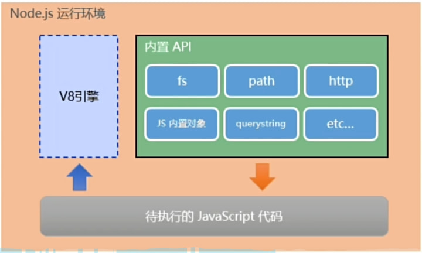
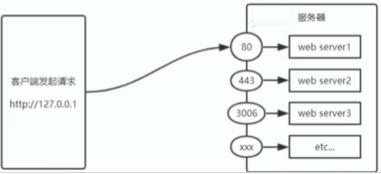

# Node.js

## 初识 Node.js

### 是什么

**Node.js 是一个基于 Chrome V8 引擎的 JavaScript 运行环境。**

Node.js官网地址：[https://nodejs.org/en](https://nodejs.org/en)



::: warning ⚠️ 注意

1. 浏览器是 JavaScript 的前端运行环境。
2. Node.js 是 JavaScript 的后端运行环境。
3. Node.js 中无法调用 DOM 和 BOM 等浏览器内置 API。

:::

### 可以做什么

1. 基于 [Express 框架](http://www.expressjs.com.cn/)，可以快速构建 Web 应用
2. 基于 [Electron 框架](https://electronjs.org/)，可以构建跨平台的桌面应用
3. 基于 [restify 框架](http://restify.com/)，可以快速构建 API 接口项目
4. 读写和操作数据库、创建实用的命令行工具辅助前端开发、etc...

### 学习路径

> JavaScript 基础语法 + Node.js 内置 API 模块（fs、path、http等）+ 第三方 API 模块（express、mysql 等）

### 环境的安装

**终端（英文：Terminal）是专门为开发人员设计的，用于实现人机交互的一种方式。**

查看安装的nodejs版本号：node -v  
运行js代码：node a.js

window终端常用快捷键：

1. 使用 ↑ 键，可以快速定位到上一次执行的命令
2. 使用 tab 键，能够快速补全路径
3. 使用 esc 键，能够快速清空当前已输入的命令
4. 输入 cls 命令，可以清空终端

## fs文件系统模块

### 什么是fs文件系统模块

**fs 模块是 Node.js 官方提供的、用来操作文件的模块。它提供了一系列的方法和属性，用来满足用户对文件的操作需求。**

例如：

- `fs.readFile()` 方法，用来读取指定文件中的内容
- `fs.writeFile()` 方法，用来向指定的文件中写入内容

如果要在 JavaScript 代码中，使用 fs 模块来操作文件，则需要使用如下的方式先导入它：

```js
const fs = require("fs");
```

### 读取指定文件中的内容

使用 `fs.readFile()` 方法，可以读取指定文件中的内容，语法格式如下：

```js
fs.readFile(path[, options], callback)
```

**参数解读：**

- 参数1：**必选参数**，字符串，表示文件的路径。
- 参数2：可选参数，表示以什么**编码格式**来读取文件。
- 参数3：**必选参数**，文件读取完成后，通过回调函数拿到读取的结果。

::: info 代码示例
可以判断 `err` 对象是否为 `null`，从而知晓文件读取的结果：

```js
const fs = require("fs");
fs.readFile("./files/1.txt", "utf8", function (err, result) {
  if (err) {
    return console.log("文件读取失败！" + err.message);
  }
  console.log("文件读取成功，内容是：" + result);
});
```

:::

### 向指定的文件中写入内容

使用 `fs.writeFile()` 方法，可以向指定的文件中写入内容，语法格式如下：

```js
fs.writeFile(file, data[, options], callback)
```

**参数解读：**

- 参数1：**必选参数**，需要指定一个**文件路径的字符串**，表示文件的存放路径。
- 参数2：**必选参数**，表示要写入的内容。
- 参数3：可选参数，表示以什么格式写入文件内容，默认值是 utf8。
- 参数4：**必选参数**，文件写入完成后的回调函数。

::: info 代码示例

可以判断 `err` 对象是否为 `null`，从而知晓文件写入的结果：

```js
const fs = require("fs");
fs.writeFile("F:/files/2.txt", "Hello Node.js!", function (err) {
  if (err) {
    return console.log("文件写入失败！" + err.message);
  }
  console.log("文件写入成功！");
});
```

:::

### 路径动态拼接问题

在使用 fs 模块操作文件时，如果提供的操作路径是以 `./` 或 `../` 开头的**相对路径**时，很容易出现路径动态拼接错误的问题。

**原因：** 代码在运行的时候，会以执行 node 命令时所处的目录，动态拼接出被操作文件的完整路径。

**解决方案：** 在使用 fs 模块操作文件时，**直接提供完整的路径**，不要提供 `./` 或 `../` 开头的相对路径，从而防止路径动态拼接的问题。

```js
// 不要使用 ./ 或 ../ 这样的相对路径
fs.readFile("./files/1.txt", "utf8", function (err, dataStr) {
  if (err) return console.log("读取文件失败！" + err.message);
  console.log(dataStr);
});

// __dirname 表示当前文件所处的目录
fs.readFile(__dirname + "/files/1.txt", "utf8", function (err, dataStr) {
  if (err) return console.log("读取文件失败！" + err.message);
  console.log(dataStr);
});
```

## path路径模块

### 什么是path路径模块

**path 模块**是 Node.js 官方提供的、用来处理路径的模块。它提供了一系列的方法和属性，用来满足用户对路径的处理需求。

例如：

- **path.join()** 方法，用来将多个路径片段拼接成一个完整的路径字符串
- **path.basename()** 方法，用来从路径字符串中，将文件名解析出来

如果要在 JavaScript 代码中，使用 path 模块来处理路径，则需要使用如下的方式先导入它：

```js
const path = require("path");
```

### 路径拼接

1. **path.join() 的语法格式**

使用 `path.join()` 方法，可以把多个路径片段拼接为完整的路径字符串，语法格式如下：

```js
path.join([...paths]);
```

**参数解读：**

- `...paths <string>` 路径片段的序列
- 返回值: `<string>`

2. **path.join() 的代码示例**

使用 `path.join()` 方法，可以把多个路径片段拼接为完整的路径字符串：

```js
const pathStr = path.join("/a", "/b/c", "..", "./d", "e");
console.log(pathStr); // 输出 \a\b\d\e

const pathStr2 = path.join(__dirname, "./files/1.txt");
console.log(pathStr2); // 输出 当前文件所处目录\files\1.txt
```

::: warning ⚠️ 注意

> 今后凡是涉及到路径拼接的操作，都要使用 `path.join()` 方法进行处理。不要直接使用 `+` 进行字符串的拼接。

:::

### 获取路径中的文件名

1. **path.basename() 的语法格式**

使用 `path.basename()` 方法，可以获取路径中的最后一部分，经常通过这个方法获取路径中的文件名，语法格式如下：

```js
path.basename(path[, ext])
```

**参数解读：**

- `path <string>` 必选参数，表示一个路径的字符串
- `ext <string>` 可选参数，表示文件扩展名
- 返回: `<string>` 表示路径中的最后一部分

2. **path.basename() 的代码示例**

使用 `path.basename()` 方法，可以从一个文件路径中，获取到文件的名称部分：

```js
const fpath = "/a/b/c/index.html"; // 文件的存放路径

var fullName = path.basename(fpath);
console.log(fullName); // 输出 index.html

var nameWithoutExt = path.basename(fpath, ".html");
console.log(nameWithoutExt); // 输出 index
```

### 获取路径中的文件扩展名

1. **path.extname() 的语法格式**

使用 `path.extname()` 方法，可以获取路径中的扩展名部分，语法格式如下：

```js
path.extname(path);
```

**参数解读：**

- `path <string>` 必选参数，表示一个路径的字符串
- 返回: `<string>` 返回得到的扩展名字符串

## http模块

### 什么是http模块

**回顾：什么是客户端、什么是服务器？**
在网络节点中，负责消费资源的电脑，叫做**客户端**；负责对外提供网络资源的电脑，叫做**服务器**。

**http 模块**是 Node.js 官方提供的、用来创建 web 服务器的模块。通过 http 模块提供的 `http.createServer()` 方法，就能方便的把一台普通的电脑，变成一台 Web 服务器，从而对外提供 Web 资源服务。

如果要希望使用 http 模块创建 Web 服务器，则需要先导入它：

```js
const http = require("http");
```

服务器和普通电脑的**区别**在于：服务器上安装了 **web 服务器软件**，例如：IIS、Apache 等。通过安装这些服务器软件，就能把一台普通的电脑变成一台 web 服务器。

在 Node.js 中，我们**不需要使用** IIS、Apache 等这些**第三方 web 服务器软件**。因为我们可以基于 Node.js 提供的 http 模块，**通过几行简单的代码，就能轻松的手写一个服务器软件**，从而对外提供 web 服务。

### 服务器相关概念

#### IP 地址

**IP 地址**就是互联网上每台计算机的唯一地址，因此 IP 地址具有唯一性。如果把“个人电脑”比作“一台电话”，那么“IP 地址”就相当于“电话号码”，只有在知道对方 IP 地址的前提下，才能与对应的电脑之间进行数据通信。

**IP 地址的格式**：通常用“点分十进制”表示成 `(a.b.c.d)` 的形式，其中，a,b,c,d 都是 0~255 之间的十进制整数。例如：用点分十进表示的 IP 地址 (192.168.1.1)

**注意：**

1. 互联网中每台 Web 服务器，都有自己的 IP 地址，例如：大家可以在 Windows 的终端中运行 `ping www.baidu.com` 命令，即可查看到百度服务器的 IP 地址。
2. 在开发期间，自己的电脑既是一台服务器，也是一个客户端，为了方便测试，可以在自己的浏览器中输入 `127.0.0.1` 这个 IP 地址，就能把自己的电脑当做一台服务器进行访问了。

#### 域名和域名服务器

尽管 IP 地址能够唯一地标记网络上的计算机，但 IP 地址是一长串数字，不直观，而且不便于记忆，于是人们又发明了另一套字符型的地址方案，即所谓的**域名（Domain Name）地址**。

**IP 地址和域名是一一对应的关系**，这份对应关系存放在一种叫做**域名服务器(DNS, Domain name server)**的电脑中。使用者只需通过好记的域名访问对应的服务器即可，对应的转换工作由域名服务器实现。因此，**域名服务器就是提供 IP 地址和域名之间的转换服务的服务器。**

**注意：**

1. 单纯使用 IP 地址，互联网中的电脑也能够正常工作。但是有了域名的加持，能让互联网的世界变得更加方便。
2. 在开发测试期间，`127.0.0.1` 对应的域名是 `localhost`，它们都代表我们自己的这台电脑，在使用效果上没有任何区别。

#### 端口号

计算机中的端口号，就好像是现实生活中的门牌号一样。通过门牌号，外卖小哥可以在整栋大楼众多的房间中，准确把外卖送到你的手中。

同样的道理，在一台电脑中，可以运行成百上千个 web 服务。每个 web 服务都对应一个唯一的端口号。客户端发送过来的网络请求，通过端口号，可以被准确地交给**对应的 web 服务**进行处理。



::: warning ⚠️ 注意

> 1. 每个端口号不能同时被多个 web 服务占用。
> 2. 80端口对应http服务；443端口对应https服务。

:::

### 创建最基本的web服务器

#### 基本步骤

1. 导入 http 模块
2. 创建 web 服务器实例
3. 为服务器实例绑定 **request** 事件，监听客户端的请求
4. 启动服务器

**代码示例：**

```js
// 1. 导入 http 模块
const http = require("http");

// 2. 创建 web 服务器实例
const server = http.createServer();

// 3. 为服务器实例绑定 request 事件，监听客户端的请求
server.on("request", function (req, res) {
  console.log("Someone visit our web server.");
});

// 4. 启动服务器
server.listen(8080, function () {
  console.log("server running at http://127.0.0.1:8080");
});
```

#### req请求对象

只要服务器接收到了客户端的请求，就会调用通过 `server.on()` 为服务器绑定的 **request** 事件处理函数。

如果想在事件处理函数中，访问与客户端相关的**数据或属性**，可以使用如下的方式：

```js
server.on("request", (req) => {
  // req 是请求对象，它包含了与客户端相关的数据和属性，例如：
  // req.url 是客户端请求的 URL 地址
  // req.method 是客户端的 method 请求类型
  const str = `Your request url is ${req.url}, and request method is ${req.method}`;
  console.log(str);
});
```

#### res响应对象

在服务器的 request 事件处理函数中，如果想访问与服务器相关的**数据或属性**，可以使用如下的方式：

```js
server.on("request", (req, res) => {
  // res 是响应对象，它包含了与服务器相关的数据和属性，例如：
  // 要发送到客户端的字符串
  const str = `Your request url is ${req.url}, and request method is ${req.method}`;
  // res.end() 方法的作用：
  // 向客户端发送指定的内容，并结束这次请求的处理过程
  res.end(str);
});
```

::: info 设置响应头防止中文乱码

```js
// 为了防止中文显示乱码的问题，需要设置响应头 Content-Type 的值为 text/html; charset=utf-8
res.setHeader("Content-Type", "text/html; charset=utf-8");
```

:::

### 根据不同的URL响应不同的html内容

- 核心实现步骤：
  1. 获取请求的 **url** 地址
  2. 设置默认的响应内容为 **404 Not found**
  3. 判断用户请求的是否为 `/` 或 `/index.html` 首页
  4. 判断用户请求的是否为 `/about.html` 关于页面
  5. 设置 **Content-Type** 响应头，防止中文乱码
  6. 使用 `res.end()` 把内容响应给客户端

## 模块化

### 模块分类与加载

**Node.js 中根据模块来源的不同，将模块分为了 3 大类，分别是：**

- **内置模块**（内置模块是由 Node.js 官方提供的，例如 `fs`、`path`、`http` 等）
- **自定义模块**（用户创建的每个 `.js` 文件，都是自定义模块）
- **第三方模块**（由第三方开发出来的模块，并非官方提供的内置模块，也不是用户创建的自定义模块，**使用前需要先下载**）

> 使用强大的 `require()` 方法，可以加载需要的**内置模块**、**用户自定义模块**、**第三方模块**进行使用。
>
> **注意：** 使用 `require()` 方法加载其它模块时，会执行被加载模块中的代码。
>
> 使用require()加载用户自定义模块时可以省略.js后缀。

### 模块作用域

和函数作用域类似，在自定义模块中定义的**变量、方法**等成员，**只能在当前模块内被访问**，这种**模块级别的访问限制**，叫做**模块作用域**。

模块作用域的好处：防止全局变量污染。

### 向外共享模块作用域中的成员

#### module 对象

在每个 `.js` 自定义模块中都有一个 `module` 对象，它里面**存储了和当前模块有关的信息**，打印如下：

```javascript
console.log(module);
```

**终端输出结果（Node.js 执行后打印的 module 对象）：**

```js
Module {
  id: '.',
  path: 'C:\\Users\\cris\\Desktop\\node\\day2\\code',
  exports: {},
  parent: null,
  filename: 'C:\\Users\\cris\\Desktop\\node\\day2\\code\\03.module对象.js',
  loaded: false,
  children: [],
  paths: [
    'C:\\Users\\cris\\Desktop\\node\\day2\\code\\node_modules',
    'C:\\Users\\cris\\Desktop\\node\\day2\\node_modules',
    'C:\\Users\\cris\\Desktop\\node\\node_modules',
    'C:\\Users\\cris\\Desktop\\node_modules',
    'C:\\Users\\cris\\node_modules',
    'C:\\Users\\node_modules',
    'C:\\node_modules'
  ]
}
```

**关键信息标注：**

- `id: '.'` → 表示当前模块是主模块或入口模块。
- `filename: '...\\03.module对象.js'` → 当前模块文件的绝对路径。
- `paths: [...]` → Node.js 查找模块时的搜索路径列表（从当前目录逐级向上查找 `node_modules`）。

#### module.export 对象

在自定义模块中，可以使用 `module.exports` 对象，将模块内的成员共享出去，供外界使用。  
外界用 `require()` 方法导入自定义模块时，得到的就是 `module.exports` 所指向的对象。

#### export 对象

由于 `module.exports` 单词写起来比较复杂，为了简化向外共享成员的代码，Node 提供了 `exports` 对象。默认情况下，`exports` 和 `module.exports` 指向同一个对象。最终共享的结果，还是以 `module.exports` 指向的对象为准。

✅ 正确用法示例：

```js
// 方式一：推荐（清晰明确）
module.exports = {
  name: "Alice",
  sayHi() {
    console.log("Hello");
  },
};

// 方式二：也可行（等价于操作 module.exports）
exports.name = "Alice";
exports.sayHi = function () {
  console.log("Hello");
};
```

❌ 错误用法：

```js
// 这样会导致 exports 不再指向 module.exports，导出为空！
exports = {
  name: "Alice",
};
```

#### module.export 和 export 的误区

**时刻谨记，`require()` 模块时，得到的永远是 `module.exports` 指向的对象：**

> **为了防止混乱，建议大家不要在同一个模块中同时使用 `exports` 和 `module.exports`**

**代码示例1：**

```js
exports.username = "zs";
module.exports = {
  gender: "男",
  age: 22,
};
```

-> 输出：

```js
{ gender: '男', age: 22 }
```

> 💡 解释：虽然先给 `exports` 添加了属性，但随后 `module.exports` 被重新赋值为新对象，因此最终导出的是这个新对象。`exports` 的修改被覆盖。

---

**代码示例2：**

```js
module.exports.username = "zs";
exports = {
  gender: "男",
  age: 22,
};
```

-> 输出：

```js
{
  username: "zs";
}
```

> 💡 解释：`module.exports.username = 'zs'` 成功添加属性；但 `exports = {...}` 只是让 `exports` 变量指向新对象，不影响 `module.exports`，所以导出仍是最初那个含 `username` 的对象。

---

**代码示例3：**

```js
exports.username = "zs";
module.exports.gender = "男";
```

-> 输出：

```js
{ username: 'zs', gender: '男' }
```

> 💡 解释：两者操作的是同一个对象（因为初始时 `exports === module.exports`），所以属性合并成功。

---

**代码示例4：**

```js
exports = {
  username: "zs",
  gender: "男",
};
module.exports = exports;
module.exports.age = "22";
```

-> 输出：

```js
{ username: 'zs', gender: '男', age: '22' }
```

> 💡 解释：这里手动将 `module.exports` 指向了 `exports` 所指向的新对象，然后继续在该对象上添加属性，因此最终导出包含所有三个字段。

### Node.js 的模块化规范—commonjs

**Node.js 遵循了 CommonJS 模块化规范，CommonJS 规定了模块的特性和各模块之间如何相互依赖。**

- CommonJS 规定：
  1. 每个模块内部，`module` 变量代表当前模块。
  2. `module` 变量是一个对象，它的 `exports` 属性（即 `module.exports`）是对外的接口。
  3. 加载某个模块，其实是加载该模块的 `module.exports` 属性。`require()` 方法用于加载模块。

## npm 与包

### npm 了解

国外有一家 IT 公司，叫做 **npm, Inc.**。这家公司旗下有一个非常著名的网站：**[https://www.npmjs.com/](https://www.npmjs.com/)**，它是**全球最大的包共享平台**。

**npm, Inc. 公司**提供了一个地址为 **[https://registry.npmjs.org/](https://registry.npmjs.org/)** 的服务器，来对外共享所有的包，我们可以从这个服务器上下载自己所需要的包。

- 从 **[https://www.npmjs.com/](https://www.npmjs.com/)** 网站上搜索自己所需要的包
- 从 **[https://registry.npmjs.org/](https://registry.npmjs.org/)** 服务器上下载自己需要的包

**npm, Inc. 公司**提供了一个包管理工具，我们可以使用这个包管理工具，从 **[https://registry.npmjs.org/](https://registry.npmjs.org/)** 服务器把需要的包下载到本地使用。

这个包管理工具的名字叫做 **Node Package Manager**（简称 **npm 包管理工具**），这个包管理工具随着 Node.js 的安装包一起被安装到了用户的电脑上。

大家可以在终端中执行 **`npm -v`** 命令，来查看自己电脑上所安装的 npm 包管理工具的版本号。

### npm install //npm i

初次装包完成后，在项目文件夹下多一个叫做 **node_modules** 的文件夹和 **package-lock.json** 的配置文件。

其中：

- **node_modules 文件夹**用来存放所有已安装到项目中的包。`require()` 导入第三方包时，就是从这个目录中查找并加载包。
- **package-lock.json 配置文件**用来记录 `node_modules` 目录下的每一个包的下载信息，例如包的名字、版本号、下载地址等。

> ⚠️ **注意：** 程序员不要手动修改 `node_modules` 或 `package-lock.json` 文件中的任何代码，npm 包管理工具会自动维护它们。

---

默认情况下，使用 `npm install` 命令安装包的时候，**会自动安装最新版本的包**。如果需要安装指定版本的包，可以在包名之后，通过 **@ 符号**指定具体的版本，例如：

```bash
npm i moment@2.22.2
```

> 💡 注：`npm i` 是 `npm install` 的简写形式，功能完全相同。

---

包的版本号是以“**点分十进制**”形式进行定义的，总共有三位数字，例如 **2.24.0**

其中每一位数字所代表的含义如下：

- **第1位数字：大版本**（Major Version）→ 表示重大更新，可能包含不兼容的 API 变更
- **第2位数字：功能版本**（Minor Version）→ 表示新增功能，但保持向后兼容
- **第3位数字：Bug修复版本**（Patch Version）→ 表示仅修复错误或安全漏洞，不影响现有功能

### 包管理配置文件

npm 规定，在**项目根目录**中，**必须**提供一个叫做 **package.json** 的包管理配置文件。用来记录与项目有关的一些配置信息。例如：

- 项目的名称、版本号、描述等
- 项目中都用到了哪些包
- 哪些包只在**开发期间**会用到
- 那些包在**开发和部署时**都需要用到

在**项目根目录**中，创建一个叫做 **package.json** 的配置文件，即可用来记录项目中安装了哪些包。从而方便剔除 `node_modules` 目录之后，在团队成员之间共享项目的源代码。

> **注意：** 在项目开发中，一定要把 `node_modules` 文件夹，添加到 `.gitignore` 忽略文件中。

npm 包管理工具提供了一个**快捷命令**，可以在**执行命令时所处的目录中**，快速创建 `package.json` 这个包管理配置文件：

```bash
// 作用：在执行命令所处的目录中，快速新建 package.json 文件
npm init -y
```

::: warning ⚠️ 注意

> 1. 上述命令**只能在英文的目录下成功运行！** 所以，项目文件夹的名称一定要使用英文命名，**不要使用中文，不能出现空格**。
> 2. 运行 `npm install` 命令安装包的时候，npm 包管理工具会自动把**包的名称和版本号**，记录到 `package.json` 中。

:::

### 装包、删包

`package.json` 文件中，有一个 **dependencies** 节点，专门用来记录您使用 `npm install` 命令安装了哪些包。

可以运行 `npm install` 命令（或 `npm i`）一次性安装所有的依赖包：

```bash
npm install
```

可以运行 `npm uninstall` 命令，来卸载指定的包：

```bash
npm uninstall moment
```

> **注意：** `npm uninstall` 命令执行成功后，会把卸载的包，自动从 `package.json` 的 `dependencies` 中移除掉。

### devDependencies

如果某些包**只在项目开发阶段**会用到，在**项目上线之后不会用到**，则建议把这些包记录到 **devDependencies** 节点中。

与之对应的，如果某些包在**开发**和**项目上线之后**都需要用到，则建议把这些包记录到 **dependencies** 节点中。

您可以使用如下的命令，将包记录到 **devDependencies** 节点中：

```bash
// 安装指定的包，并记录到 devDependencies 节点中
npm i 包名 -D

// 注意：上述命令是简写形式，等价于下面完整的写法：
npm install 包名 --save-dev
```

> 判断应该装包到devDependencies节点还是dependencies节点，直接npmjs.com官网查一下对应包的安装命令即可。

### npm镜像

> 淘宝在国内搭建了一个服务器，专门把国外官方服务器上的包同步到国内的服务器，然后在国内提供下包的服务。从而极大的提高了下包的速度。
>
> **镜像（Mirroring）** 是一种文件存储形式，一个磁盘上的数据在另一个磁盘上存在一个完全相同的副本即为镜像。

- **国内用户** → 从国外服务器下包 → **国外 npm 官方服务器**
- **国内用户** → 从国内服务器下包 → **国内淘宝npm镜像服务器** →(定期同步)→ **国外 npm 官方服务器**

下包的镜像源，指的就是**下包的服务器地址**。

```bash
# 查看当前的下包镜像源
npm config get registry

# 将下包的镜像源切换为淘宝镜像源
npm config set registry=https://registry.npmmirror.com/

# 检查镜像源是否下载成功
npm config get registry
```

::: warning ⚠️ 注意
目前（2024年起）淘宝已启用新域名：**https://registry.npmmirror.com/**  
原 `registry.npm.taobao.org` 已逐步停用，请优先使用新地址。
:::

#### nrm插件

为了更方便的切换下包的镜像源，我们可以安装 **nrm** 这个小工具，利用 nrm 提供的终端命令，可以快速查看和切换下包的镜像源。

```bash
# 通过 npm 包管理器，将 nrm 安装为全局可用的工具
npm i nrm -g

# 查看所有可用的镜像源
nrm ls

# 将下包的镜像源切换为 taobao 镜像
nrm use taobao
```

### 包的分类

#### 项目包

那些被安装到**项目的 `node_modules` 目录**中的包，都是**项目包**。

项目包又分为两类，分别是：

- **开发依赖包**（被记录到 `devDependencies` 节点中的包，只在开发期间会用到）
- **核心依赖包**（被记录到 `dependencies` 节点中的包，在开发期间和项目上线之后都会用到）

```bash
npm i 包名 -D    # 开发依赖包（会被记录到 devDependencies 节点下）
npm i 包名       # 核心依赖包（会被记录到 dependencies 节点下）
```

#### 全局包

在执行 `npm install` 命令时，如果提供了 `-g` 参数，则会把包安装为**全局包**。

全局包会被安装到：  
`C:\Users\用户目录\AppData\Roaming\npm\node_modules` 目录下。（Windows 系统路径示例）

```bash
npm i 包名 -g        # 全局安装指定的包
npm uninstall 包名 -g # 卸载全局安装的包
```

::: warning ⚠️ 注意

1. 只有**工具性质的包**，才有全局安装的必要性。因为它们提供了好用的终端命令。  
     例如：`nodemon`, `eslint`, `create-react-app`, `vue-cli`, `typescript (tsc)` 等。
2. 判断某个包是否需要全局安装后才能使用，可以**参考官方提供的使用说明**即可。

:::

### 规范的包结构

一个规范的包，它的组成结构，必须符合以下 3 点要求：

1. 包必须以**单独的目录**而存在
2. 包的顶级目录下要必须包含 **package.json** 这个包管理配置文件
3. **package.json** 中必须包含 **name**, **version**, **main** 这三个属性，分别代表**包的名字、版本号、包的入口**。

### 发布包 – 开发属于自己的包

## 模块的加载机制

## express

### express 简介

### express 的基本使用

### express 托管静态资源

### nodemon 工具

### express 路由

#### 路由的概念

#### 路由的使用

### express 中间件

#### 中间件的概念与格式

#### 中间件的使用

#### 中间件的分类

#### 自定义中间件

### 使用 express 写接口

#### 基本流程

#### 跨域问题

#### JSONP

## 数据库

### 数据库基本概念

### 安装并配置 MySQL

### MySQL Workbench 使用

### 使用 SQL 管理数据库

#### 什么是 SQL

#### SQL 的增删改查语句

#### SQL 的 where、and 和 or

#### SQL 排序 order by

#### count 函数和 as 关键字

### nodejs 中怎么使用 MySQL 模块

#### 引入 MySQL 模块

#### 增删改查

## 前后端的身份认证

### web 开发模式

### 身份认证

### session

#### 概念

#### express-session 中间件

### jwt

#### JWT

#### JWT 在 express 中的使用
