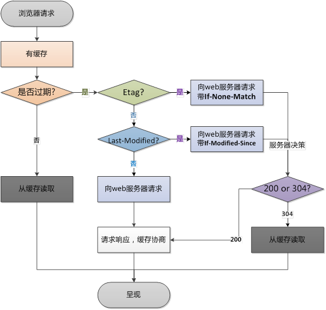

# 网络【todo】

## 基础概念

### 浏览器从输入URL到显示页面的过程

::: info 流程

> 1. 用户输入 URL 并回车
> 2. DNS 解析
> 3. 建立 TCP 连接，发起 HTTP 请求
> 4. 服务器处理并返回响应
> 5. 浏览器接收响应并开始解析
> 6. 布局（Layout / Reflow）
> 7. 绘制
> 8. 合成（Composite）
> 9. 后续资源加载与交互

:::

#### 第 1 步：用户输入 URL 并回车

- 浏览器解析输入内容：
  - 如果是关键词（如 “天气”），可能走默认搜索引擎；
  - 如果是合法 URL（如 `https://github.com/`），进入下一步。

#### 第 2 步：DNS 解析（将域名转为 IP 地址）

**浏览器检查缓存顺序：**

DNS缓存 -> 本地Hosts文件 -> 向本地DNS服务器发起查询 -> 若未命中，递归查询根域名服务器/顶级域（.com）/权威DNS服务器

- 最终获得目标服务器的 **IP 地址**（如 `20.205.243.166`）

#### 第 3 步：建立 TCP 连接，发起 HTTP 请求

- 浏览器通过 **TCP 协议** 与服务器 IP 建立连接（默认端口 80/HTTP 或 443/HTTPS）。
- 浏览器构造 HTTP 请求报文
- 通过已建立的 TCP（或 QUIC）连接发送请求。

#### 第 4 步：服务器处理并返回响应

- 服务器收到请求后：
  - 路由匹配
  - 执行后端逻辑（如查询数据库）
  - 生成 HTML 内容
- 返回 HTTP 响应

#### 第 5 步：浏览器接收响应并开始解析

1. 解析 HTML 构建 DOM 树
   - 浏览器逐字节解析 HTML，遇到标签就创建 DOM 节点。
   - **遇到 `<script>`**：
     - 若无 `async`/`defer`：**阻塞 HTML 解析**，立即下载并执行 JS。
     - `defer`：延迟到 DOM 解析完后执行（按顺序）。
     - `async`：异步下载，下载完立即执行（不保证顺序）。
   - **遇到 `<link rel="stylesheet">`**：
     - CSS 不阻塞 HTML 解析，但**阻塞 DOM 渲染**（因需构建 CSSOM）。

2. 加载 CSS 并构建 CSSOM
   - 下载 CSS 文件 → 解析 → 构建 **CSSOM（CSS Object Model）**
   - CSSOM 与 DOM 结合形成 **Render Tree（渲染树）**

3. 构建 Render Tree
   - Render Tree = DOM + CSSOM（只包含可见元素，如 `display: none` 的节点会被剔除）

#### 第 6 步：布局（Layout / Reflow）

- 计算每个 Render Tree 节点的**几何信息**（位置、大小）。这个过程也叫 **Reflow**。根节点（viewport）开始，递归计算。

#### 第 7 步：绘制（Paint / Rasterization）

- 将 Render Tree 转换为屏幕上的像素。
- 分层（Layer）处理：如 transform、opacity 元素会提升为单独图层。
- 绘制指令发送给 GPU（合成阶段）。

#### 第 8 步：合成（Composite）

- 浏览器将多个图层**按顺序合并**，生成最终图像。
- 由 **Compositor 线程**完成，不阻塞主线程。
- 显示在屏幕上。

> ✅ 至此，**首屏内容已渲染完成（First Paint / First Contentful Paint）**

#### 第 9 步：后续资源加载与交互

- 执行 JS（如 `DOMContentLoaded` 事件触发）
- 加载图片、视频、字体等非关键资源
- 执行 `window.onload`（所有资源加载完毕）
- 用户可交互（如点击按钮、滚动）

### 网络层级 - OSI 七层模型

| 层数 | 名称                    | 核心功能                                     | 前端是否关心？    | 关联前端场景                                                           |
| ---- | ----------------------- | -------------------------------------------- | ----------------- | ---------------------------------------------------------------------- |
| 7    | 应用层（Application）   | 提供用户接口和网络服务（如 HTTP、FTP、SMTP） | ✅ 高度相关       | `fetch()`、`XMLHttpRequest`、WebSocket、API 调用、浏览器地址栏访问网页 |
| 6    | 表示层（Presentation）  | 数据格式转换、加密解密、压缩                 | ⚠️ 间接相关       | HTTPS 中的 TLS 加密（如证书、AES）、JSON/XML 编码、图片压缩（WebP）    |
| 5    | 会话层（Session）       | 建立、管理和终止会话（对话控制）             | ⚠️ 基本不直接接触 | 登录会话（Session ID）、WebSocket 长连接维持（可视为会话）             |
| 4    | 传输层（Transport）     | 端到端通信、可靠传输（TCP）或快速传输（UDP） | ⚠️ 需了解概念     | TCP 保证请求完整到达；HTTP/HTTPS 基于 TCP；WebSocket 也基于 TCP        |
| 3    | 网络层（Network）       | 路由选择、IP 寻址                            | ❌ 不关心         | IP 地址分配、路由器转发（由操作系统/网络设备处理）                     |
| 2    | 数据链路层（Data Link） | 同一局域网内设备通信（MAC 地址）             | ❌ 不关心         | Wi-Fi、以太网帧传输（底层硬件处理）                                    |
| 1    | 物理层（Physical）      | 传输比特流（电压、光信号等）                 | ❌ 完全无关       | 网线、光纤、无线信号                                                   |

| 应用层协议 | 作用                                       | 前端场景                                     |
| ---------- | ------------------------------------------ | -------------------------------------------- |
| HTTP/HTTPS | 获取 HTML、CSS、JS、图片、API 数据         | 所有页面加载和 Ajax 请求                     |
| WebSocket  | 双向实时通信                               | 聊天、股票行情、在线协作                     |
| DNS        | 将域名（如 `api.example.com`）转为 IP 地址 | 影响首屏加载速度，可通过 `dns-prefetch` 优化 |

### 客户端 & 服务端

| 角色             | 定义                           | 典型代表                                                     | 前端相关职责                                                                                |
| ---------------- | ------------------------------ | ------------------------------------------------------------ | ------------------------------------------------------------------------------------------- |
| 客户端（Client） | 发起请求的一方，等待并处理响应 | 浏览器（Chrome/Firefox）、手机 App、Node.js 脚本             | - 发起 API 请求（`fetch`/`axios`）<br>- 渲染页面<br>- 处理用户交互<br>- 管理 Cookie / Token |
| 服务器（Server） | 接收请求并返回数据的一方       | Web 服务器（Nginx）、后端服务（Node.js/Java/Python）、数据库 | - 提供 HTML/CSS/JS 文件<br>- 处理业务逻辑<br>- 验证身份<br>- 返回 JSON 或静态资源           |

### ip地址/域名/DNS

#### 1. **IP 地址（Internet Protocol Address）**

- **是什么**：一串数字标识，用于**唯一标识网络中的设备**
  - IPv4 示例：`114.114.114.114`
  - IPv6 示例：`2001:db8::1`
- **作用**：网络设备之间通信的“真实地址”，就像电话号码。
- **前端视角**：
  - 浏览器最终是通过 IP 地址连接服务器的

> ⚠️ 问题：IP 难记、会变（服务器迁移），怎么办？

#### 2. **域名（Domain Name）**

- **是什么**：人类可读的地址，如 `www.taobao.com`、`api.github.com`
- **作用**：代替难记的 IP 地址，方便用户访问和开发者配置
- **前端使用场景**：
  ```js
  fetch("https://api.example.com/users");
  ```
  ```html
  <script src="https://cdn.jsdelivr.net/npm/vue@3"></script>
  ```

> ✅ 域名 = 用户友好的“别名”

#### 3. **DNS（Domain Name System，域名系统）**

- **是什么**：一个分布式“电话簿”，**将域名翻译成 IP 地址**
- **作用**：当你输入 `https://baidu.com`，浏览器先问 DNS：“这个域名对应的 IP 是多少？”
- **过程简述**：
  1. 浏览器检查本地缓存 → 操作系统缓存 → 路由器缓存
  2. 若都没命中，向 **DNS 服务器**（如 8.8.8.8）发起查询
  3. 最终拿到 IP（如 `220.181.38.148`），再建立 TCP 连接

- 🌐 **DNS 查询示意图（简化）**：

  ```
  前端代码 → 域名 (api.example.com)
        ↓
    [DNS 查询]
        ↓
  IP 地址 (93.184.216.34)
        ↓
  建立 TCP/TLS 连接 → 发送 HTTP 请求
  ```

## TCP/UDP协议

> **位置**：传输层（Transport Layer）  
> **作用**：为应用层提供端到端（进程到进程）的数据传输服务

| 特性         | TCP                                        | UDP                                 |
| ------------ | ------------------------------------------ | ----------------------------------- |
| **连接方式** | 面向连接                                   | 无连接                              |
| **可靠性**   | 可靠传输（保证送达、不丢包、不重复、按序） | 不可靠（尽最大努力交付，不保证）    |
| **数据单位** | 字节流（Byte Stream）                      | 数据报（Datagram）                  |
| **传输开销** | 高（头部20~60字节，含控制字段）            | 低（头部固定8字节）                 |
| **传输速度** | 较慢（因确认、重传、流量控制等机制）       | 快（无连接建立、无确认）            |
| **拥塞控制** | 有（慢启动、拥塞避免等）                   | 无                                  |
| **适用场景** | 文件传输、网页浏览、邮件、数据库访问等     | 视频会议、直播、在线游戏、DNS、VoIP |

### TCP协议

#### 1. **三次握手** —— 建立连接

```
Client → Server: SYN (seq=x) 第一次握手：证明客户端能发送
Server → Client: SYN-ACK (seq=y, ack=x+1) 第二次握手：证明服务器能接收和发送
Client → Server: ACK (ack=y+1) 第三次握手：证明客户端能接收
```

- 目的：同步初始序列号，确保双方收发能力正常
- 防止历史重复连接初始化（旧 SYN 报文突然到达）

#### 2. **四次挥手** —— 关闭连接

```
主动方 → 被动方: FIN
被动方 → 主动方: ACK
（被动方可能还有数据要发）
被动方 → 主动方: FIN
主动方 → 被动方: ACK
```

- TCP 连接是**全双工**的，需双向关闭
- 主动关闭方进入 `TIME_WAIT` 状态（等待 2MSL），确保最后 ACK 被收到

#### 3. **可靠传输机制**

- **序列号（Sequence Number）** + **确认号（Acknowledgment Number）**：标识字节流位置，实现按序交付
- **超时重传（Retransmission）**：未收到 ACK 则重发
- **累计确认（Cumulative ACK）**：确认号表示“该序号前所有数据已收到”
- **快速重传（Fast Retransmit）**：收到3个重复 ACK 即重传，不等超时

#### 4. **流量控制（Flow Control）**

- 使用 **滑动窗口（Sliding Window）** 机制
- 接收方通过 **窗口字段（Window Size）** 告知发送方还能接收多少字节
- 防止发送方“淹没”接收方缓冲区

#### 5. **拥塞控制（Congestion Control）**

- 慢启动（Slow Start）：指数增长 cwnd（拥塞窗口）
- 拥塞避免（Congestion Avoidance）：线性增长
- 快速重传 & 快速恢复（Fast Recovery）
- 目标：避免网络过载，公平共享带宽

### UDP协议

#### 1. **协议结构（头部仅8字节）**

```
| 源端口（2B） | 目的端口（2B） |
| 长度（2B）   | 校验和（2B）   |
```

- **长度**：包括头部和数据
- **校验和**：可选（IPv4 中可关闭，IPv6 中强制开启），用于检测传输错误

#### 2. **工作方式**

- 应用层将数据交给 UDP，UDP 封装成数据报直接交给网络层（IP）
- 无连接建立、无状态维护、无重传机制
- 每个数据报独立路由，可能乱序、丢失、重复

#### 3. **优势**

- 开销小、延迟低
- 支持广播/多播（TCP 仅支持单播）
- 适用于容忍少量丢包但要求实时性的场景

## HTTP/HTTPS协议

### HTTP/HTTPS是什么

**HTTP（HyperText Transfer Protocol）** 是一种**应用层协议**，用于在客户端（如浏览器）和服务器之间传输超文本（HTML、图片、JSON 等）。它是 Web 的基础。

**特点：**

- **无状态**：每个请求独立，服务器不保存上下文（需靠 Cookie/Token 维持会话）
- **基于请求-响应模型**：客户端发请求 → 服务器返回响应
- **明文传输**：数据未加密，容易被窃听或篡改（这是 HTTP 最大缺陷）

---

**HTTPS（HTTP Secure）** = **HTTP + TLS/SSL 加密层**

它在 HTTP 和 TCP 之间加入了一层**安全传输层（TLS/SSL）**，实现：

- **加密**：防止内容被窃听
- **完整性校验**：防止数据被篡改
- **身份认证**：通过数字证书验证服务器身份

> ✅ 现代网站几乎都强制使用 HTTPS（浏览器对 HTTP 网站标记为“不安全”）

---

| 对比项     | HTTP               | HTTPS                                                    |
| ---------- | ------------------ | -------------------------------------------------------- |
| 默认端口   | 80                 | 443                                                      |
| 安全性     | 明文传输，不安全   | 加密传输，安全                                           |
| 性能       | 略快（无加密开销） | 略慢（需 TLS 握手），但 HTTP/2 可弥补                    |
| SEO        | 搜索引擎降权       | 搜索引擎优先收录                                         |
| 浏览器支持 | 所有               | 需有效 SSL 证书                                          |
| 前端限制   | 无                 | 某些 API（如 Geolocation、Service Worker）**仅限 HTTPS** |

### 请求方式

| 方法       | 全称   | 用途                 | 是否幂等                | 是否可缓存 | 前端典型使用场景                   |
| ---------- | ------ | -------------------- | ----------------------- | ---------- | ---------------------------------- |
| **GET**    | GET    | 获取资源             | ✅ 是                   | ✅ 是      | 加载页面、获取列表数据、搜索       |
| **POST**   | POST   | 提交数据（创建资源） | ❌ 否                   | ❌ 否      | 用户注册、登录、提交表单、上传文件 |
| **PUT**    | PUT    | **全量更新**资源     | ✅ 是                   | ❌ 否      | 修改用户资料（需传完整字段）       |
| **PATCH**  | PATCH  | **部分更新**资源     | ❌ 否（通常视为非幂等） | ❌ 否      | 修改用户名、更新头像等局部字段     |
| **DELETE** | DELETE | 删除资源             | ✅ 是                   | ❌ 否      | 删除文章、取消关注                 |

> 🔔 **幂等性（Idempotent）**：多次执行相同请求，结果与执行一次相同（对系统状态影响一致）。  
> ⚠️ **可缓存**：仅 GET 请求默认可被浏览器或代理缓存。

### 状态码

| 类别    | 含义                                   |
| ------- | -------------------------------------- |
| **1xx** | 信息性响应（请求已被接收，继续处理）   |
| **2xx** | **成功**（请求已成功处理）             |
| **3xx** | **重定向**（需进一步操作才能完成请求） |
| **4xx** | **客户端错误**（请求有误或无法完成）   |
| **5xx** | **服务器错误**（服务器处理出错）       |

| 状态码  | 名称                  | 含义                                       | 前端场景                            |
| ------- | --------------------- | ------------------------------------------ | ----------------------------------- |
| **200** | OK                    | 请求成功，响应体包含结果                   | API 返回数据、页面正常加载          |
| **201** | Created               | 资源创建成功                               | 用户注册、新建文章后返回新资源      |
| **204** | No Content            | 请求成功，但无返回内容                     | 删除操作、更新成功但无需返回数据    |
| **301** | Moved Permanently     | 永久重定向（旧 URL 已废弃）                | 浏览器/搜索引擎会缓存，自动跳新地址 |
| **302** | Found                 | 临时重定向                                 | 常用于登录后跳转、A/B 测试          |
| **304** | Not Modified          | **协商缓存命中**，资源未修改               | 浏览器使用本地缓存，**无响应体**    |
| **400** | Bad Request           | 请求格式错误（如 JSON 格式不对、参数缺失） | 检查请求体、参数校验                |
| **401** | Unauthorized          | **未认证**（缺少或无效 Token/Cookie）      | 跳转登录页，清除本地 Token          |
| **403** | Forbidden             | **已认证但无权限**访问该资源               | 提示“权限不足”，勿跳登录            |
| **404** | Not Found             | 请求的资源不存在（路径错误或已被删除）     | 检查 API 路径、显示友好 404 页面    |
| **405** | Method Not Allowed    | 请求方法不被允许（如对只读接口发 POST）    | 检查 API 文档                       |
| **429** | Too Many Requests     | 请求过于频繁（触发限流）                   | 提示“操作太频繁，请稍后再试”        |
| **500** | Internal Server Error | 服务器内部错误（代码崩溃、异常未捕获）     | 显示“服务异常，请稍后重试”          |
| **502** | Bad Gateway           | 网关错误（如 Nginx 无法连接后端服务）      | 通常是后端服务宕机                  |
| **503** | Service Unavailable   | 服务不可用（维护中或过载）                 | 可提示“系统维护中”                  |
| **504** | Gateway Timeout       | 网关超时（后端处理太慢）                   | 建议用户稍后重试                    |

### 请求头与响应头

| 常用请求头          | 说明                                     | 前端使用场景                                                                                                                 |
| ------------------- | ---------------------------------------- | ---------------------------------------------------------------------------------------------------------------------------- |
| `Accept`            | 告诉服务器客户端能接收的 MIME 类型       | `Accept: application/json` 表示期望返回 JSON                                                                                 |
| `Content-Type`      | 声明请求体的数据格式                     | - `application/json`（JSON API）<br>- `multipart/form-data`（文件上传）<br>- `application/x-www-form-urlencoded`（表单提交） |
| `Authorization`     | 携带认证凭证                             | `Authorization: Bearer <token>`（JWT 认证）<br>`Authorization: Basic base64(user:pass)`                                      |
| `Cookie`            | 自动携带当前域名下的 Cookie              | 用于会话保持（如 sessionId），通常由浏览器自动管理                                                                           |
| `User-Agent`        | 标识客户端（浏览器/设备信息）            | 后端可据此做兼容处理（前端一般不修改）                                                                                       |
| `Referer`           | 当前页面 URL（来源页）                   | 用于防盗链、统计分析（注意：可能被隐私策略屏蔽）                                                                             |
| `Origin`            | 跨域请求时标识请求来源（协议+域名+端口） | CORS 判断是否允许跨域的关键字段                                                                                              |
| `If-None-Match`     | 携带 ETag 值，用于协商缓存               | 浏览器自动设置，若资源未变，服务器返回 304                                                                                   |
| `If-Modified-Since` | 携带上次修改时间，用于协商缓存           | 同上，基于时间戳的缓存验证                                                                                                   |

| 常用响应头                         | 说明                     | 前端影响                                                                                                              |
| ---------------------------------- | ------------------------ | --------------------------------------------------------------------------------------------------------------------- |
| `Content-Type`                     | 响应体的 MIME 类型和编码 | 决定浏览器如何解析内容：<br>- `text/html; charset=utf-8` → 渲染 HTML<br>- `application/json` → 可被 `res.json()` 解析 |
| `Set-Cookie`                       | 服务器设置 Cookie        | 浏览器自动存储，并在后续请求中通过 `Cookie` 头发送<br>可带属性：`HttpOnly`、`Secure`、`SameSite`、`Path`              |
| `Cache-Control`                    | 控制缓存策略（最重要！） | - `max-age=3600`：强缓存 1 小时<br>- `no-cache`：走协商缓存<br>- `no-store`：禁止缓存（敏感数据）                     |
| `ETag`                             | 资源唯一标识（类似指纹） | 用于协商缓存，下次请求通过 `If-None-Match` 对比                                                                       |
| `Last-Modified`                    | 资源最后修改时间         | 协商缓存备用方案（精度低，不如 ETag）                                                                                 |
| `Access-Control-Allow-Origin`      | CORS 允许的源            | 如 `Access-Control-Allow-Origin: https://example.com`<br>或 `*`（仅限不带凭证的请求）                                 |
| `Access-Control-Allow-Credentials` | 是否允许携带 Cookie      | 设为 `true` 时，前端需设置 `credentials: 'include'`                                                                   |
| `Location`                         | 重定向目标 URL           | 配合 3xx 状态码使用（如 302）                                                                                         |
| `Content-Encoding`                 | 响应体压缩方式           | 如 `gzip`、`br`（Brotli），浏览器自动解压                                                                             |
| `Content-Security-Policy` (CSP)    | 定义资源加载白名单       | 防 XSS 攻击，限制 script/style/img 等来源                                                                             |

### HTTP版本

#### 一、HTTP/1.0（1996 年）

核心特点：

- **每个请求都要新建 TCP 连接**，用完即关。
- 无持久连接（Keep-Alive 需手动开启）。
- 无 Host 头（无法在同一 IP 上部署多个网站）。

前端影响：
❌ 性能极差：加载一个页面（含 CSS/JS/图片）需建立多次 TCP 连接（三次握手开销大）。  
✅ 现代浏览器和服务器**已不再使用纯 HTTP/1.0**。

---

#### 二、HTTP/1.1（1999 年，至今仍广泛兼容）

核心改进：

- ✅ **持久连接（Persistent Connection）**：默认复用 TCP 连接（`Connection: keep-alive`）。
- ✅ **Host 头**：支持虚拟主机（同一 IP 托管多个域名）。
- ✅ **缓存控制**：引入 `Cache-Control`、`ETag` 等更精细的缓存机制。
- ✅ **分块传输（Chunked Transfer）**：支持流式响应。

仍存在的问题（对前端性能不利）：

- ❌ **队头阻塞（Head-of-Line Blocking）**：  
  同一 TCP 连接上，请求必须**按顺序处理**。若第一个请求慢，后面的都得等。
- ❌ **头部冗余**：每个请求都携带重复的 Cookie、User-Agent 等，浪费带宽。

前端应对策略（HTTP/1.1 时代）：

- 合并 JS/CSS 文件（减少请求数）
- 使用雪碧图（CSS Sprite）
- 域名分片（Domain Sharding）：用多个子域名并行加载资源（如 `static1.example.com`）

> ⚠️ 注意：这些“优化”在 HTTP/2 下反而**有害**！

---

#### 三、HTTP/2（2015 年标准化，现代主流）

核心特性（解决 HTTP/1.1 痛点）：

- ✅ **多路复用（Multiplexing）**：  
  同一 TCP 连接上可**并行发送多个请求/响应**，彻底解决队头阻塞。
- ✅ **头部压缩（HPACK）**：  
  使用静态/动态字典压缩 Header，减少体积（尤其对含大 Cookie 的请求效果显著）。
- ✅ **二进制分帧（Binary Framing）**：  
  将请求/响应拆分为帧（Frame），更高效解析。
- ✅ **服务端推送（Server Push）**（较少使用）：  
  服务器可主动推送资源（如 HTML 返回时预推 CSS/JS）。

对前端的影响：

- ✅ **无需合并文件**：小文件独立加载更利于缓存更新。
- ✅ **无需域名分片**：单域名即可高效并行。
- ✅ **首屏加载更快**：关键资源可优先传输。

---

#### 四、HTTP/3（2022 年正式标准化，逐步普及）

核心变革：

- ✅ **底层从 TCP 改为 UDP**（基于 **QUIC 协议**）。
- ✅ **解决 TCP 层的队头阻塞**：  
  TCP 中一个包丢失会导致整个连接等待重传；而 QUIC 在**连接内每个流独立**，丢包不影响其他流。
- ✅ **更快的连接建立**：  
  TLS 1.3 + QUIC 握手可在 **1 个 RTT 甚至 0 RTT** 完成（比 HTTP/2 更快）。
- ✅ **连接迁移**：  
  切换网络（如 WiFi → 4G）时，连接不中断（适合移动端）。

对前端的意义：

- 🚀 **弱网环境下体验显著提升**（视频、游戏、实时应用受益大）。
- 🌐 **更适合移动 Web 应用**。
- 🔒 依然强制 HTTPS。

---

#### 五、HTTP版本对比

| 特性         | HTTP/1.1           | HTTP/2              | HTTP/3            |
| ------------ | ------------------ | ------------------- | ----------------- |
| 传输层       | TCP                | TCP                 | **UDP (QUIC)**    |
| 多路复用     | ❌                 | ✅                  | ✅（更优）        |
| 队头阻塞     | ✅（连接级）       | ❌（流级解决）      | ❌（完全解决）    |
| 头部压缩     | ❌                 | ✅（HPACK）         | ✅（QPACK）       |
| 加密         | 可选（HTTP/HTTPS） | **强制 HTTPS**      | **强制 HTTPS**    |
| 连接建立速度 | 慢（TCP + TLS）    | 较快（TLS 1.2/1.3） | **极快（0-RTT）** |
| 前端优化重点 | 合并资源、域名分片 | 按需加载、模块化    | 无需特殊优化      |

## 同源策略与跨域(CORS)

**同源（Same Origin）** 指两个 URL 的以下三部分**完全相同**：

- **协议（Protocol）**：如 `http` / `https`
- **域名（Host）**：如 `www.example.com`
- **端口（Port）**：如 `80`（HTTP 默认）、`443`（HTTPS 默认）、`3000`

### 同源策略

「同源策略」（Same-Origin Policy）是浏览器的一项**安全机制**，用于限制一个源的文档或脚本如何与另一个源的资源进行交互。

**浏览器限制的行为包括：**

- ❌ 通过 `fetch`/`XMLHttpRequest` 读取**非同源**的响应内容（即使请求发出去了）
- ❌ 访问非同源 iframe 的 DOM
- ❌ 读取非同源 Cookie、LocalStorage（但 Cookie 可通过设置 `Domain` 共享子域）

> ✅ 允许的行为（不会被阻止）：
>
> - ``、`<script>`、`<link>`、`<video>` 等标签加载跨域资源（但无法读取其内容）
> - 表单提交到跨域地址（但 JS 无法读取响应）

### 跨域

| 方案           | 是否需后端配合 | 支持方法 | 适用场景         | 推荐度     |
| -------------- | -------------- | -------- | ---------------- | ---------- |
| **CORS**       | ✅ 是          | 所有     | 生产环境标准方案 | ⭐⭐⭐⭐⭐ |
| **开发代理**   | ❌ 否          | 所有     | 本地开发         | ⭐⭐⭐⭐⭐ |
| **Nginx 代理** | ❌（需运维）   | 所有     | 生产环境部署     | ⭐⭐⭐⭐   |
| **JSONP**      | ✅ 是          | 仅 GET   | 老系统兼容       | ⭐         |

#### 1. CORS（跨域资源共享）—— **生产环境首选**

**原理：** 后端在响应头中添加 `Access-Control-Allow-Origin` 等字段，**显式授权**前端域名访问。

**适用场景：** 前后端分离项目（如 Vue/React + Spring Boot/Node.js）、第三方 API 支持 CORS。

**优点：** 标准化、安全、支持所有 HTTP 方法（GET/POST/PUT/DELETE）、浏览器原生支持。

**缺点：** 需要**后端配合**，复杂请求会触发预检（OPTIONS），增加一次网络往返。

> ⚠️ 若使用 `credentials: true`，`Allow-Origin` 不能为 `*`，必须指定具体域名。

---

#### 2. 开发代理（DevServer Proxy）—— **开发环境首选**

**原理：** 前端开发服务器（如 Webpack DevServer、Vite）作为**代理**，将 `/api` 开头的请求转发到后端真实地址。→ 浏览器认为是同源请求，无跨域。

**适用场景：** 本地开发（前端 `localhost:3000`，后端 `localhost:8080`）。

**优点：** **无需后端改代码**，配置简单，热更新友好。

**缺点：** **仅限开发环境**，生产环境无效。

---

#### 3. Nginx 反向代理 —— **生产环境高性能方案**

**原理：** 通过 Nginx 将前端域名下的 `/api` 路径**代理**到后端服务。→ 浏览器只与 Nginx 通信（同源），Nginx 再转发给后端。

**适用场景：** 生产环境部署（尤其高并发项目），无法修改后端 CORS 配置时。

**优点：** 统一入口，便于负载均衡、SSL 终止，对前端透明，**前后端均无需特殊处理**。

**缺点：** 需要运维介入配置。

---

#### 4. JSONP —— **仅用于兼容老系统**

**原理：** 利用 `<script>` 标签**不受同源策略限制**的特性，动态加载 JS 文件，服务器返回“回调函数包裹的数据”。

**适用场景：** 调用**只支持 JSONP 的第三方接口**（如某些老地图 API），需兼容 IE8/9 等老旧浏览器。

**优点：** 兼容性极好

**缺点：** **仅支持 GET 请求**，有 XSS 安全风险，无法处理错误状态码（如 500）

> 🚫 现代项目**不推荐使用**！

## 浏览器缓存机制

浏览器缓存机制是前端性能优化的核心手段之一，它能显著减少网络请求、加快页面加载速度。浏览器缓存主要分为两类：**强缓存** 和 **协商缓存**。



- 优先级
  1. **强缓存优先**：如果 `Cache-Control` 或 `Expires` 有效，直接使用缓存，**不发请求**。
  2. **强缓存失效后**，才进入协商缓存阶段。
  3. **ETag 优先级高于 Last-Modified**：如果两者都存在，服务器优先校验 ETag。

### 强缓存

> **特点**：命中后**不发请求到服务器**，直接使用本地缓存。

| 响应头字段      | 说明                               | 优先级                   |
| --------------- | ---------------------------------- | ------------------------ |
| `Cache-Control` | HTTP/1.1 标准，功能强大            | **高**（优先于 Expires） |
| `Expires`       | HTTP/1.0 字段，指定过期时间（GMT） | 低                       |

| 常用`Cache-Control`指令 | 作用                                               |
| ----------------------- | -------------------------------------------------- |
| `max-age=3600`          | 缓存 3600 秒（相对时间）                           |
| `no-cache`              | **跳过强缓存，但走协商缓存**（常被误解为“不缓存”） |
| `no-store`              | **禁止一切缓存**（敏感数据如银行页面）             |
| `public`                | 可被任何中间代理缓存                               |
| `private`               | 仅用户浏览器可缓存（默认）                         |

### 协商缓存

> **特点**：**会发请求到服务器**，但服务器根据条件判断是否返回新内容。若未修改，返回 `304 Not Modified`，浏览器使用本地缓存。

- 方式 1：Last-Modified / If-Modified-Since
  - **服务器逻辑**：比较文件最后修改时间，若未变 → 返回 `304`

  > ⚠️ 缺陷：
  >
  > - 时间精度只到秒，1 秒内多次修改无法识别；
  > - 文件内容未变但时间戳变了，会误判为已修改。

- 方式 2：ETag / If-None-Match（推荐）
  - **服务器逻辑**：比对 ETag，一致 → 返回 `304`

## 网络安全

### XSS攻击

### CSRF攻击

### CSP内容安全策略

## 性能优化中的网络技巧
