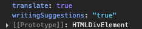

# TypeScript 基础

## 综述

TypeScript（简称：TS）是 JavaScript 的超集（JS 有的 TS 都有）。  
TypeScript = Type + JavaScript（在 JS 基础之上，为 JS 添加了类型支持）。

从编程语言的动静态来区分，TypeScript 属于**静态类型的编程语言**，JS 属于**动态类型的编程语言**。

- **静态类型：** 编译期做类型检查
- **动态类型：** 执行期做类型检查

**代码编译和代码执行的顺序：1 编译 → 2 执行**

- 对于 JS 来说：需要等到代码真正去**执行**的时候才能**发现错误**（晚）。
- 对于 TS 来说：在代码**编译**的时候（代码执行前）就可以**发现错误**（早）。
- 配合 VSCode 等开发工具，TS 可以**提前到在编写代码的同时**就发现代码中的错误，减少找 Bug、改 Bug 时间。

::: info 优势

1. 更早（写代码的同时）发现错误，减少找 Bug、改 Bug 时间，提升开发效率。
2. 程序中任何位置的代码都有**代码提示**，随时随地的安全感，增强了开发体验。
3. 强大的**类型系统**提升了代码的可维护性，使得**重构代码更加容易**。
4. 支持最新的 **ECMAScript 语法**，优先体验最新的语法，让你走在前端技术的最前沿。
5. TS 类型推断机制，**不需要在代码中的每个地方都显式标注类型**，让你在享受优势的同时，尽量降低了成本。

> 除此之外，Vue 3 源码使用 TS 重写、Angular 默认支持 TS、React 与 TS 完美配合，TypeScript 已成为大中型前端项目的首选编程语言。

:::

## 初体验

::: info 安装编译TS的工具包

**问题：为什么要安装编译 TS 的工具包？**  
**回答：** Node.js / 浏览器，只认识 JS 代码，不认识 TS 代码。需要先将 TS 代码转化为 JS 代码，然后才能运行。

**安装命令：** `npm i -g typescript`  
**typescript 包：** 用来编译 TS 代码的包，提供了 `tsc` 命令，实现了 TS → JS 的转化。  
**验证是否安装成功：** `tsc -v`（查看 typescript 的版本）

:::

::: info 编译并运行TS代码

1. 创建 `hello.ts` 文件（注意：TS 文件的后缀名为 `.ts`）。
2. 将 TS 编译为 JS：在终端中输入命令，`tsc hello.ts`（此时，在同级目录中会出现一个同名的 JS 文件）。
3. 执行 JS 代码：在终端中输入命令，`node hello.js`。

:::

::: info 简化运行TS的步骤

**问题描述：** 每次修改代码后，都要重复执行两个命令，才能运行 TS 代码，太繁琐。  
**简化方式：** 使用 `ts-node` 包，直接在 Node.js 中执行 TS 代码。

**安装命令：** `npm i -g ts-node`  
**使用方式：** `ts-node hello.ts`

:::

## 常用基础类型

### 综述

TypeScript 是 JS 的超集，TS 提供了 JS 的所有功能，并且额外增加了：**类型系统**。

- 所有的 JS 代码都是 TS 代码。
- JS 有类型（比如，number/string 等），但是 **JS 不会检查变量的类型是否发生变化**。而 **TS 会检查**。

TypeScript 类型系统的主要优势：可以**显示标记出代码中的意外行为**，从而降低了发生错误的可能性。

---

可以将 TS 中的常用基础类型细分为两类：1. JS 已有类型; 2. TS 新增类型

- 1.  JS 已有类型
  - **原始类型**：`number` / `string` / `boolean` / `null` / `undefined` / `symbol`
  - **对象类型**：`object`（包括：数组、对象、函数等对象）

- 2. TS 新增类型
  - 联合类型
  - 自定义类型（类型别名）
  - 接口
  - 元组
  - 字面量类型
  - 枚举
  - `void`
  - `any`

---

#### **类型注解**

**示例代码：**

```ts
let age: number = 18;
```

**说明：** 代码中的 `: number` 就是**类型注解**。  
**作用：** 为变量添加**类型约束**。比如，上述代码中，约定变量 `age` 的类型为 `number`（数值类型）。  
**解释：** 约定了什么类型，就只能给变量赋值该类型的值，否则，就会报错。

```ts
let age: number = "18";
// > ❌ 不能将类型“string”分配给类型“number”。 ts(2322)
```

#### typeof

**众所周知，JS 提供了 typeof 操作符，用来在 JS 中获取数据的类型。**

```js
console.log(typeof "Hello world"); // 打印 string
```

**实际上，TS 也提供了 typeof 操作符：可以在类型上下文中引用变量或属性的类型（类型查询）。**

**使用场景：** 根据已有变量的值，获取该值的类型，来简化类型书写。

```ts
let p = { x: 1, y: 2 };
function formatPoint(point: { x: number; y: number }) {}
formatPoint(p);

function formatPoint(point: typeof p) {}
```

**解释：**

1. 使用 `typeof` 操作符来获取变量 `p` 的类型，结果与第一种（对象字面量形式的类型）相同。
2. `typeof` 出现在**类型注解的位置**（参数名称的冒号后面）所处的环境就在**类型上下文**（区别于 JS 代码）。
3. 注意：`typeof` 只能用来查询变量或属性的类型，无法查询其他形式的类型（比如，函数调用的类型）。

### 原始类型

**原始类型：** `number` / `string` / `boolean` / `null` / `undefined` / `symbol`  
**特点：** 简单。这些类型，完全按照 JS 中类型的名称来书写。

```ts
let age: number = 18;
let myName: string = "刘老师";
let isLoading: boolean = false;
// 等等...
```

### 数组类型（含联合类型说明）

**对象类型：** `object`（包括：数组、对象、函数等对象）。  
**特点：** 对象类型在 TS 中更加细化，每个具体的对象都有自己的类型语法。

数组类型的两种写法：（推荐使用 `number[]` 写法）

```ts
let numbers: number[] = [1, 3, 5];
let strings: Array<string> = ["a", "b", "c"];
```

---

**需求：** 数组中既有 `number` 类型，又有 `string` 类型，这个数组的类型应该如何写？

```ts
let arr: (number | string)[] = [1, "a", 3, "b"];
```

**解释：** `|`（竖线）在 TS 中叫做**联合类型**（由两个或多个其他类型组成的类型，表示可以是这些类型中的任意一种）。

### 类型别名

**类型别名（自定义类型）：** 为任意类型起别名。  
**使用场景：** 当同一类型（复杂）被多次使用时，可以通过类型别名，简化该类型的使用。

```ts
type CustomArray = (number | string)[];
let arr1: CustomArray = [1, "a", 3, "b"];
let arr2: CustomArray = ["x", "y", 6, 7];
```

**解释：**

1. 使用 `type` 关键字来创建类型别名。
2. 类型别名（比如此处的 `CustomArray`），可以是任意合法的变量名称。
3. 创建类型别名后，直接使用该类型别名作为变量的类型注解即可。

### 函数类型

函数的类型实际上指的是：**函数参数和返回值的类型**。

为函数指定类型的两种方式：

1. 单独指定参数、返回值的类型
2. 同时指定参数、返回值的类型

::: info 1. 单独指定参数、返回值的类型

```ts
function add(num1: number, num2: number): number {
  return num1 + num2;
}
```

```ts
const add = (num1: number, num2: number): number => {
  return num1 + num2;
};
```

:::

::: info 2. 同时指定参数、返回值的类型

```ts
const add: (num1: number, num2: number) => number = (num1, num2) => {
  return num1 + num2;
};
```

**解释：** 当函数作为表达式时，可以通过类似箭头函数形式的语法来为函数添加类型。  
**注意：** 这种形式只适用于函数表达式。

:::

---

如果函数没有返回值，那么，函数返回值类型为：**void**。

```ts
function greet(name: string): void {
  console.log("Hello", name);
}
```

使用函数实现某个功能时，参数可以传也可以不传。这种情况下，在给函数参数指定类型时，就用到**可选参数**了。  
比如，数组的 `slice` 方法，可以 `slice()` 也可以 `slice(1)` 还可以 `slice(1, 3)`。

```ts
function mySlice(start?: number, end?: number): void {
  console.log("起始索引:", start, "结束索引:", end);
}
```

**可选参数：** 在可传可不传的参数名称后面添加 `?`（问号）。  
**注意：** 可选参数只能出现在参数列表的最后，也就是说可选参数后面不能再出现必选参数。

### 对象类型

JS 中的对象是由属性和方法构成的，而 TS 中对象的类型就是在描述对象的结构（有什么类型的属性和方法）。

**对象类型的写法：**

```ts
let person: { name: string; age: number; sayHi(): void } = {
  name: "jack",
  age: 19,
  sayHi() {},
};
```

**解释：**

1. 直接使用 `{}` 来描述对象结构。属性采用 `属性名: 类型` 的形式；方法采用 `方法名(): 返回值类型` 的形式。
2. 如果方法有参数，就在方法名后面的小括号中指定参数类型（比如：`greet(name: string): void`）。
3. 在一行代码中指定对象的多个属性类型时，使用 `;`（分号）来分隔。
4. 如果一行代码只指定一个属性类型（通过换行来分隔多个属性类型），可以去掉 `;`（分号）。
5. 方法的类型也可以使用箭头函数形式（比如：`{ sayHi: () => void }`）。

---

对象的属性或方法，也可以是可选的，此时就用到**可选属性**了。

比如，我们在使用 `axios({ ... })` 时，如果发送 GET 请求，`method` 属性就可以省略。

```ts
function myAxios(config: { url: string; method?: string }) {
  console.log(config);
}
```

**可选属性的语法与函数可选参数的语法一致，都使用 `?`（问号）来表示。**

### 接口

当一个对象类型被多次使用时，一般会使用**接口（interface）**来描述对象的类型，达到**复用**的目的。

**解释：**

1. 使用 `interface` 关键字来声明接口。
2. 接口名称（比如，此处的 `IPerson`），可以是任意合法的变量名称。
3. 声明接口后，直接使用接口名称作为变量的类型。
4. 因为每一行只有一个属性类型，因此，属性类型后没有 `;`（分号）。

```ts
interface IPerson {
  name: string;
  age: number;
  sayHi(): void;
}

let person: IPerson = {
  name: "jack",
  age: 19,
  sayHi() {},
};
```

#### 对比 type

- **相同点**：都可以给对象指定类型。
- **不同点**：
  - 接口，只能为对象指定类型。
  - 类型别名，不仅可以为对象指定类型，实际上可以为任意类型指定别名。

```ts
interface IPerson {
  name: string;
  age: number;
  sayHi(): void;
}
```

```ts
type IPerson = {
  name: string;
  age: number;
  sayHi(): void;
};
```

```ts
type NumStr = number | string;
```

#### 继承

如果两个接口之间有相同的属性或方法，可以将公共的属性或方法抽离出来，通过**继承**来实现复用。

比如，这两个接口都有 `x`、`y` 两个属性，重复写两次可以，但很繁琐。

```ts
interface Point2D {
  x: number;
  y: number;
}
interface Point3D {
  x: number;
  y: number;
  z: number;
}
```

**更好的方式：**

```ts
interface Point2D {
  x: number;
  y: number;
}
interface Point3D extends Point2D {
  z: number;
}
```

**解释：**

1. 使用 `extends`（继承）关键字实现了接口 `Point3D` 继承 `Point2D`。
2. 继承后，`Point3D` 就有了 `Point2D` 的所有属性和方法（此时，`Point3D` 同时有 `x`、`y`、`z` 三个属性）。

### 元组

**场景：** 在地图中，使用经纬度坐标来标记位置信息。  
可以使用数组来记录坐标，那么，该数组中只有两个元素，并且这两个元素都是数值类型。

```ts
let position: number[] = [39.5427, 116.2317];
```

**使用 `number[]` 的缺点：** 不严谨，因为该类型的数组中可以出现任意多个数字。

**更好的方式：元组（Tuple）。**

元组类型是另一种类型的数组，它**确切地知道包含多少个元素，以及特定索引对应的类型**。

```ts
let position: [number, number] = [39.5427, 116.2317];
```

**解释：**

1. 元组类型可以确切地标记出有多少个元素，以及每个元素的类型。
2. 该示例中，元组有两个元素，每个元素的类型都是 `number`。

### 类型推论

在 TS 中，某些没有明确指出类型的地方，TS 的**类型推论机制**会帮助提供类型。  
换句话说：由于类型推论的存在，这些地方，**类型注解可以省略不写！**

发生类型推论的 2 种常见场景：

1. 声明变量并初始化时
2. 定义函数返回值时

```ts
let age: number; // TS 自动推断出变量 age 为 number 类型

let age = 18; // 鼠标移入变量名称 age
```

```ts
function add(num1: number, num2: number): number; // 函数返回值类型可推断

function add(num1: number, num2: number) {
  return num1 + num2;
} // 省略返回值类型，鼠标移入函数名称 add，即可查看返回值类型为 number
```

**注意：** 这两种情况下，**类型注解可以省略不写！**  
**推荐：** 能省略类型注解的地方就省略（偷懒），充分利用 TS 类型推论的能力，提升开发效率。  
**技巧：** 如果不知道类型，可以通过鼠标放在变量名称上，利用 VSCode 的提示来查看类型。

### 类型断言

有时候你会让 TS 更加明确一个值的类型，此时，可以使用**类型断言**来指定更具体的类型。  
比如，

```html
<a href="https://github.com/" id="link">GitHub</a>
```

```ts
const aLink: HTMLElement; // 鼠标移入变量名称 aLink，即可查看类型为 HTMLElement
const aLink = document.getElementById("link");
```

**注意：** `getElementById` 方法返回值的类型是 `HTMLElement`，该类型只包含所有标签公共的属性或方法，不包含 `a` 标签特有的 `href` 等属性。  
因此，这个类型太宽泛（不具体），无法操作 `href` 等 `a` 标签特有的属性或方法。

**解决方式：** 这种情况下就需要**使用类型断言指定更加具体的类型**。

**使用类型断言：**

```ts
const aLink: HTMLAnchorElement; // 鼠标移入，显示类型为 HTMLAnchorElement
const aLink = document.getElementById("link") as HTMLAnchorElement;
```

**解释：**

1. 使用 `as` 关键字实现类型断言。
2. 关键字 `as` 后面的类型是一个更加具体的类型（`HTMLAnchorElement` 是 `HTMLElement` 的子类型）。
3. 通过类型断言，`aLink` 的类型变得更加具体，这样就可以访问 `a` 标签特有的属性或方法了。

**另一种语法，使用 `< >` 语法，这种语法形式不常用知道即可：**

```ts
const aLink = <HTMLAnchorElement>document.getElementById("link");
```

**技巧：** 在浏览器控制台，通过 `console.dir()` 打印 DOM 元素，在属性列表的最后面，即可看到该元素的类型。



### 字面量类型

**思考以下代码，两个变量的类型分别是什么？**

```ts
let str1 = "Hello TS";
const str2 = "Hello TS";
```

**通过 TS 类型推论机制，可以得到答案：**

1. 变量 `str1` 的类型为：`string`。
2. 变量 `str2` 的类型为：`'Hello TS'`。

**解释：**

1. `str1` 是一个变量（`let`），它的值可以是任意字符串，所以类型为：`string`。
2. `str2` 是一个常量（`const`），它的值不能变化，只能是 `'Hello TS'`，所以，它的类型为：`'Hello TS'`。

**注意：** 此处的 `'Hello TS'`，就是一个**字面量类型**。也就是说，**某个特定的字符串也可以作为 TS 中的类型**。  
除字符串外，任意的 JS 字面量（比如，对象、数字等）都可以作为类型使用。

**使用模式：** 字面量类型配合联合类型一起使用。

**使用场景：** 用来表示一组明确的可选值列表。

比如，在贪吃蛇游戏中，游戏的方向的可选值只能是上、下、左、右中的任意一个。

```ts
function changeDirection(direction: "up" | "down" | "left" | "right") {
  console.log(direction);
}
```

**解释：** 参数 `direction` 的值只能是 `up`/`down`/`left`/`right` 中的任意一个。  
**优势：** 相比于 `string` 类型，使用字面量类型更加精确、严谨。

### 枚举

枚举的功能类似于字面量类型+联合类型组合的功能，也可以表示一组明确的可选值。

**枚举：定义一组命名常量。** 它描述一个值，该值可以是这些命名常量中的一个。

```ts
enum Direction {
  Up,
  Down,
  Left,
  Right,
}

function changeDirection(direction: Direction) {
  console.log(direction);
}
```

**解释：**

1. 使用 `enum` 关键字定义枚举。
2. 约定枚举名称、枚举中的值以大写字母开头。
3. 枚举中的多个值之间通过逗号（`,`）分隔。
4. 定义好枚举后，直接使用枚举名称作为类型注解。

---

**注意：** 形参 `direction` 的类型为枚举 `Direction`，那么，实参的值就应该是枚举 `Direction` 成员的任意一个。

**访问枚举成员：**

```ts
changeDirection(Direction.Up);
```

**解释：** 类似于 JS 中的对象，直接通过点（`.`）语法访问枚举的成员。

---

**问题：** 我们把枚举成员作为了函数的实参，它的值是什么呢？

```ts
changeDirection(Direction.Up);
```

> （enum member）Direction.Up = 0

**解释：** 通过将鼠标移入 `Direction.Up`，可以看到枚举成员 `Up` 的值为 `0`。
**注意：** 枚举成员是有值的，默认认为：从 0 开始自增的数值。

我们把枚举成员的值为数字的枚举，称为：**数字枚举**。

当然，也可以给枚举中的成员初始化值。

```ts
// Down -> 11, Left -> 12, Right -> 13
enum Direction {
  Up = 10,
  Down,
  Left,
  Right,
}

enum Direction {
  Up = 2,
  Down = 4,
  Left = 8,
  Right = 16,
}
```

---

**字符串枚举：** 枚举成员的值是字符串。

```ts
enum Direction {
  Up = "UP",
  Down = "DOWN",
  Left = "LEFT",
  Right = "RIGHT",
}
```

**注意：** 字符串枚举没有自增长行为，因此，字符串枚举的每个成员必须有初始值。

---

枚举是 TS 为数不多的非 JavaScript 类型级扩展（不仅仅是类型的）特性之一。

因为：其他类型仅仅被当做类型，而**枚举不仅用作类型，还提供值**（枚举成员都是有值的）。

也就是说，其他的类型会在编译为 JS 代码时自动移除。但是，**枚举类型会被编译为 JS 代码！**

```ts
enum Direction {
  Up = "UP",
  Down = "DOWN",
  Left = "LEFT",
  Right = "RIGHT",
}
```

→

```js
var Direction;
(function (Direction) {
  Direction["Up"] = "UP";
  Direction["Down"] = "DOWN";
  Direction["Left"] = "LEFT";
  Direction["Right"] = "RIGHT";
})(Direction || (Direction = {}));
```

**说明：** 枚举与前面讲到的字面量类型+联合类型组合的功能类似，都用来表示一组明确的可选值列表。  
一般情况下，**推荐使用字面量类型+联合类型组合的方式**，因为相比枚举，这种方式更加直观、简洁、高效。

### `any` 类型

**原则：不推荐使用 any！**

这会让 TypeScript 变为 “AnyScript”（失去 TS 类型保护的优势）。

因为当值的类型为 `any` 时，可以对该值进行任意操作，并且不会有代码提示。

```ts
let obj: any = { x: 0 };

obj.bar = 100;
obj();
const n: number = obj;
```

**解释：**

以上操作都不会有任何类型错误提示，即使可能存在错误！

- 尽可能地避免使用 `any` 类型，除非**临时使用 any 来“避免”书写很长、很复杂的类型**！

其他隐式具有 `any` 类型的情况：

1. 声明变量不提供类型也不提供默认值
2. 函数参数不加类型

**注意：** 因为不推荐使用 `any`，所以，这两种情况下都应该提供类型！

## 类型声明文件

### TS中的两种文件类型

TS 中有两种文件类型：

1. `.ts` 文件
2. `.d.ts` 文件

#### **`.ts` 文件**

- `.ts` 是 **implementation**（代码实现文件）

1. 既包含类型信息又可执行代码。
2. 可以被编译为 `.js` 文件，然后执行代码。
3. 用途：编写程序代码的地方。

#### **`.d.ts` 文件**

- `.d.ts` 是 **declaration**（类型声明文件）
  > 如果要为 JS 库提供类型信息，要使用 `.d.ts` 文件。

1. 只包含类型信息的类型声明文件。
2. 不会生成 `.js` 文件，仅用于提供类型信息。
3. 用途：为 JS 提供类型信息。

### 类型声明文件的使用说明

#### 使用已有的类型声明文件

**使用已有的类型声明文件：1 内置类型声明文件 2 第三方库的类型声明文件。**

::: info 内置类型声明文件

**内置类型声明文件**：TS 为 JS 运行时可用的所有标准化内置 API 都提供了声明文件。

比如，在使用数组时，数组所有方法都会有相应的代码提示以及类型信息：

```ts
(method) Array<number>.forEach(callbackfn: (value: number, index: number, array: number[]) => void, thisArg?: any): void
```

实际上这都是 TS 提供的内置类型声明文件。  
可以通过 Ctrl + 鼠标左键（Mac: option + 鼠标左键）来查看内置类型声明文件内容。  
比如，查看 forEach 方法的类型声明，在 VSCode 中会自动跳转到 `lib.es5.d.ts` 类型声明文件中。  
当然，像 window、document 等 BOM、DOM API 也都有相应的类型声明（`lib.dom.d.ts`）。
:::

::: info 第三方库的类型声明文件

**第三方库的类型声明文件**：目前，几乎所有常用的第三方库都有相应的类型声明文件。

第三方库的类型声明文件有两种存在形式：

- 库自带类型声明文件：比如，axios。
- 由 DefinitelyTyped 提供。

1. **库自带类型声明文件**：比如，axios。

```
node_modules
└── axios
    ├── dist
    ├── lib
    ├── CHANGELOG.md
    ├── index.d.ts     ← TS 类型声明文件
    └── index.js      ← JavaScript 源码文件
```

解释：这种情况下，正常导入该库，TS 就会自动加载库自己的类型声明文件，以提供该库的类型声明。

2. **由 DefinitelyTyped 提供**。

**DefinitelyTyped** 是一个 GitHub 仓库，用来提供高质量 TypeScript 类型声明。

可以通过 npm/yarn 来下载该仓库提供的 TS 类型声明包，这些包的名称格式为：`@types/*`。

比如，`@types/react`、`@types/lodash` 等。

说明：在实际项目开发时，如果你使用的第三方库没有自带的声明文件，VSCode 会给出明确的提示。

```ts
import _ from "lodash"; // 报错提示
import { difference } from "lodash"; // 报错提示
```

尝试使用 `npm i --save-dev @types/lodash`（如果存在），或者添加一个包含 `declare module 'lodash';` 的新声明（`.d.ts`）文件 ts(7016)

解释：当安装 `@types/*` 类型声明包后，TS 也会自动加载该声明包，以提供该库的类型声明。

补充：TS 官方文档提供了一个页面，可以来查询 `@types/*` 库。

:::

#### 创建自己的类型声明文件

**创建自己的类型声明文件：1 项目内共享类型 2 为已有 JS 文件提供类型声明。**

1. **项目内共享类型**：如果多个 `.ts` 文件中都用到同一个类型，此时可以创建 `.d.ts` 文件提供该类型，实现类型共享。

> **操作步骤：**
>
> 1. 创建 `index.d.ts` 类型声明文件。
> 2. 创建需要共享的类型，并使用 `export` 导出（TS 中的类型也可以使用 `import/export` 实现模块化功能）。
> 3. 在需要使用共享类型的 `.ts` 文件中，通过 `import` 导入即可（`.d.ts` 后缀导入时，直接省略）。

2. **为已有 JS 文件提供类型声明：**
   1. 在将 JS 项目迁移到 TS 项目时，为了让已有的 `.js` 文件有类型声明。
   2. 成为库作者，创建库给其他人使用。

> **注意**：类型声明文件的编写与模块化方式相关，不同的模块化方式有不同的写法。但由于历史原因，JS 模块化的发展经历过多种变化（AMD、CommonJS、UMD、ESModule 等），而 TS 支持各种模块化形式的类型声明。这就导致，类型声明文件相关内容又多又杂。

::: info 说明
**说明**：TS 项目中也可以使用 `.js` 文件。  
**说明**：在导入 `.js` 文件时，TS 会自动加载与 `.js` 同名的 `.d.ts` 文件，以提供类型声明。

**`declare` 关键字**：用于类型声明，为其他地方（比如，`.js` 文件）已存在的变量声明类型，而不是创建一个新的变量。

1. 对于 `type`、`interface` 等这些明确就是 TS 类型的（只能在 TS 中使用的），可以省略 `declare` 关键字。
2. 对于 `let`、`function` 等具有双重含义（在 JS、TS 中都能用），应该使用 `declare` 关键字，明确指定此处用于类型声明。
   :::
