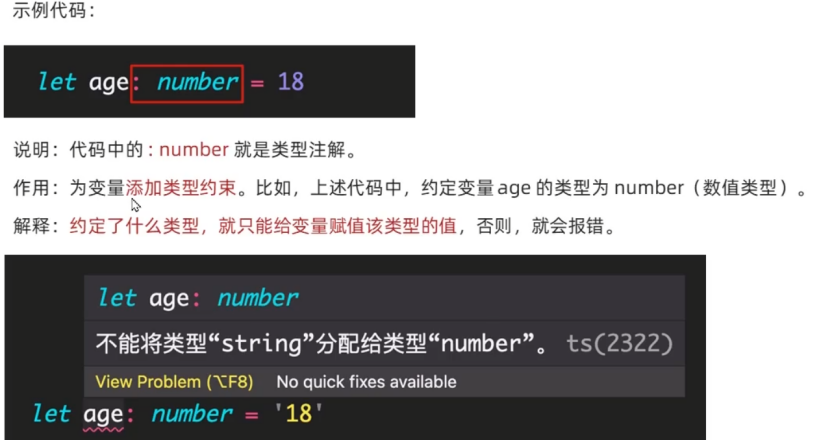

# TypeScript

## 综述

### 是什么

- TypeScript（简称：TS）是 JavaScript 的超集（JS 有的 TS 都有）。
- TypeScript = Type + JavaScript（在 JS 基础之上，为 JS 添加了类型支持）。
- TypeScript 是微软开发的开源编程语言，可以在任何运行 JavaScript 的地方运行。

### 为什么

- 背景：JS 的类型系统存在“先天缺陷”，JS 代码中绝大部分错误都是**类型错误**（Uncaught TypeError）。
- 问题：增加了找 Bug、改 Bug 的时间，严重影响开发效率。

从编程语言的动静态来区分，TypeScript 属于**静态类型的编程语言**，JS 属于**动态类型的编程语言**。

- **静态类型：** 编译期做类型检查
- **动态类型：** 执行期做类型检查

**代码编译和代码执行的顺序：1 编译 → 2 执行**

- 对于 JS 来说：需要等到代码真正去**执行**的时候才能**发现错误**（晚）。
- 对于 TS 来说：在代码**编译**的时候（代码执行前）就可以**发现错误**（早）。
- 配合 VSCode 等开发工具，TS 可以**提前到在编写代码的同时**就发现代码中的错误，减少找 Bug、改 Bug 时间。

### 优势

1. 更早（写代码的同时）发现错误，减少找 Bug、改 Bug 时间，提升开发效率。
2. 程序中任何位置的代码都有**代码提示**，随时随地的安全感，增强了开发体验。
3. 强大的**类型系统**提升了代码的可维护性，使得**重构代码更加容易**。
4. 支持最新的 **ECMAScript 语法**，优先体验最新的语法，让你走在前端技术的最前沿。
5. TS 类型推断机制，**不需要在代码中的每个地方都显式标注类型**，让你在享受优势的同时，尽量降低了成本。

> 除此之外，Vue 3 源码使用 TS 重写、Angular 默认支持 TS、React 与 TS 完美配合，TypeScript 已成为大中型前端项目的首选编程语言。

## 初体验

### 安装编译TS的工具包

**问题：为什么要安装编译 TS 的工具包？**

**回答：** Node.js / 浏览器，只认识 JS 代码，不认识 TS 代码。需要先将 TS 代码转化为 JS 代码，然后才能运行。

**安装命令：** `npm i -g typescript`

**typescript 包：** 用来编译 TS 代码的包，提供了 `tsc` 命令，实现了 TS → JS 的转化。

**验证是否安装成功：** `tsc -v`（查看 typescript 的版本）

### 编译并运行TS代码

1. 创建 `hello.ts` 文件（注意：TS 文件的后缀名为 `.ts`）。
2. 将 TS 编译为 JS：在终端中输入命令，`tsc hello.ts`（此时，在同级目录中会出现一个同名的 JS 文件）。
3. 执行 JS 代码：在终端中输入命令，`node hello.js`。

- **1 创建 ts 文件** → **2 编译 TS** → **3 执行 JS**

> **说明：** 所有合法的 JS 代码都是 TS 代码，有 JS 基础只需要学习 TS 的类型即可。
>
> **注意：** 由 TS 编译生成的 JS 文件，代码中就没有类型信息了。

### 简化运行TS的步骤

**问题描述：** 每次修改代码后，都要重复执行两个命令，才能运行 TS 代码，太繁琐。

**简化方式：** 使用 `ts-node` 包，直接在 Node.js 中执行 TS 代码。

**安装命令：** `npm i -g ts-node`

**使用方式：** `ts-node hello.ts`

**解释：** `ts-node` 命令在内部偷偷地将 TS → JS，然后，再运行 JS 代码。

## 常用基础类型

TypeScript 是 JS 的超集，TS 提供了 JS 的所有功能，并且额外增加了：**类型系统**。

- 所有的 JS 代码都是 TS 代码。
- JS 有类型（比如，number/string 等），但是 **JS 不会检查变量的类型是否发生变化**。而 **TS 会检查**。

TypeScript 类型系统的主要优势：可以**显示标记出代码中的意外行为**，从而降低了发生错误的可能性。

---

**类型注解**

### 原始类型

### 数组类型（含联合类型说明）

### 类型别名

### 函数类型

### 对象类型

### 接口

### 元组

### 类型推论

### 类型断言

### 字面量类型

### 枚举

### `any` 类型

## 高级类型

### class 类

### 类型兼容性

### 交叉类型

### 泛型

### 索引签名类型

### 映射类型

## 类型声明文件

### 两种文件类型

### 类型声明文件的使用说明
