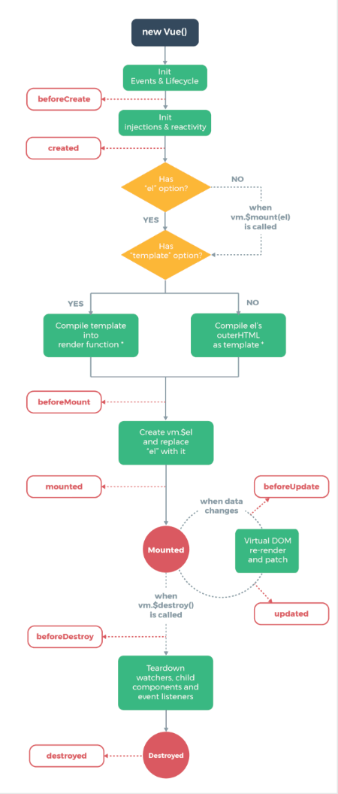

# Vue2 基础

## 认识vue

- Vue特点: 解耦视图和数据、可复用的组件、前端路由技术、状态管理、虚拟DOM。
- Vue.js安装方式：1. 直接CDN引入 2. 下载引入 3. NPM安装
- Vue中的MVVM架构：
  - M：model数据层，可能是死数据，也可能来自于服务器。
  - V：view视图层，前端通常指dom层。主要作用给用户展示各种信息
  - VM：vuemodel视图模型层，是view和model沟通的桥梁。主要作用：一、实现了data binding（数据绑定），将model的改变实时的反应到view中。二、实现dom listener（dom监听），当dom发生某些事件时，可以根据需要改变对应的data。

::: info 创建vue实例时可传入的options

| 属性         | 类型                 | 说明                             |
| ------------ | -------------------- | -------------------------------- |
| `el`         | String / HTMLElement | 挂载点，指定Vue实例管理的DOM元素 |
| `data`       | Object / Function    | 数据对象，Vue实例的数据来源      |
| `methods`    | Object               | 方法对象，定义Vue实例的方法      |
| `computed`   | Object               | 计算属性，基于依赖缓存的计算结果 |
| `components` | Object               | 组件对象，注册局部组件           |
| `filters`    | Object               | 过滤器对象，注册局部过滤器       |
| `watch`      | Object               | 监听属性，监听数据变化并执行回调 |
| `props`      | Array / Object       | 属性列表，接收父组件传递的数据   |
| `template`   | String               | 模板字符串，组件的模板内容       |
| `render`     | Function             | 渲染函数，createElement函数      |

:::

::: info 计算属性

计算属性是基于依赖缓存的计算结果，当依赖的属性发生变化时，计算属性会自动更新。  
每个计算属性都包含一个getter和一个setter。默认只有getter。

> **计算属性的缓存：**  
> methods和computed看起来都可以实现我们的功能，那么为什么还要多一个计算属性这个东西呢？原因：计算属性会进行缓存，如果多次使用时，计算属性只会调用一次。

:::

### 生命周期钩子

::: info 生命周期钩子

| 属性            | 类型     | 说明           |
| --------------- | -------- | -------------- |
| `beforeCreate`  | Function | 实例创建前钩子 |
| `created`       | Function | 实例创建后钩子 |
| `beforeMount`   | Function | 挂载前钩子     |
| `mounted`       | Function | 挂载后钩子     |
| `beforeUpdate`  | Function | 更新前钩子     |
| `updated`       | Function | 更新后钩子     |
| `beforeDestroy` | Function | 销毁前钩子     |
| `destroyed`     | Function | 销毁后钩子     |


:::

## vue基础语法

Mustache语法(也就是双大括号)，双大括号中也可以进行简单的运算，比如：加减乘除等。

### 指令

| 指令      | 作用描述                                                                                                                |
| --------- | ----------------------------------------------------------------------------------------------------------------------- |
| v-bind    | 属性绑定。动态地绑定一个或多个 HTML 属性（如 `src`, `href`, `class`, `style`）。                                        |
| v-on      | 事件监听。绑定事件监听器，触发时执行 Vue 实例中的方法。支持事件修饰符（如 `.stop`, `.prevent`）。                       |
| v-model   | 双向数据绑定。主要在表单元素（input, select, textarea）上使用，数据变化视图更新，视图变化数据更新。                     |
| v-if      | 条件渲染 (销毁/重建)。如果表达式为假，元素不会存在于 DOM 中。切换开销大，适合条件不常变动的情况。                       |
| v-else    | 条件渲染 (否则)。配合 `v-if` 使用，表示"否则"的块。                                                                     |
| v-else-if | 条件渲染 (多重判断)。配合 `v-if` 使用，表示"else if"块。                                                                |
| v-show    | 条件渲染 (显示/隐藏)。无论真假，元素始终渲染在 DOM 中，只是切换 CSS 的 `display: none` 属性。切换开销小，适合频繁切换。 |
| v-for     | 列表渲染。基于源数据多次渲染元素或模板块。建议配合 `key` 使用。                                                         |
| v-text    | 更新文本内容。更新元素的 `textContent`。与插值类似，但不会闪烁（FOUC）。                                                |
| v-html    | 更新 HTML 内容。更新元素的 `innerHTML`。注意： 容易导致 XSS 攻击，仅在内容可信时使用。                                  |
| v-pre     | 跳过编译。跳过这个元素和它的子元素的编译过程。可以用来显示原始 Mustache 标签。                                          |
| v-once    | 只渲染一次。元素和它的所有子节点将被视为静态内容，只渲染一次，后续数据变化不会引起更新。                                |
| v-cloak   | 防止闪烁。这个指令保持在元素上直到关联实例结束编译。配合 CSS `[v-cloak] { display: none }` 解决插值闪烁问题。           |

**语法糖：**  
`v-bind` 指令的语法糖是 `:attr="value"`，用于绑定属性值。  
`v-on` 指令的语法糖是 `@event="handler"`，用于绑定事件监听器。

::: info v-bind 绑定属性

1. 绑定类名 (`:class`)

Vue 为 `class` 绑定提供了专门的增强，支持**对象语法**和**数组语法**。

**对象语法**  
适用于：**根据条件动态切换类名**（键为类名，值为布尔值判断条件）。

- **用法：直接绑定类，与普通类共存（不冲突），可配合计算属性或方法（推荐）**

  ```html
  <h2 class="title" :class="{'active': isActive, 'line': isLine}">
    Hello World
  </h2>
  <!-- 当逻辑过于复杂时，可将其抽离到 `methods` 或 `computed` 中，保持模板整洁。 -->
  <h2 class="title" :class="classes">Hello World</h2>
  ```

**数组语法**  
适用于：**应用一个 class 列表**（数组内的元素可以是字符串变量、三元表达式或对象）。

- **用法：直接绑定类，与普通类共存（不冲突），可配合计算属性或方法**

  ```html
  <h2 class="title" :class="['active', 'line']">Hello World</h2>
  <!-- 注：classes 是一个返回数组的计算属性 -->
  <h2 class="title" :class="classes">Hello World</h2>
  ```

---

2. 绑定内联样式 (`:style`)

`:style` 的对象语法: CSS 属性名推荐使用驼峰式（如 `fontSize`），如果使用短横线分隔（如 `'font-size'`），必须用单引号括起来。

**对象语法（推荐）**  
`style` 后面跟的是一个对象类型，对象的 `key` 是 CSS 属性名称，`value` 是具体的值（可来自 `data` 或计算属性）。

```html
<div :style="{ color: currentColor, fontSize: fontSize + 'px' }"></div>
```

**数组语法**  
`style` 后面跟的是一个数组类型，可以将多个样式对象应用到同一个元素上，多个值以逗号分割。

```html
<div :style="[baseStyles, overridingStyles]"></div>
```

:::

::: info v-on 事件监听

v-on指令 缩写@  
当通过methods中定义方法，以供@click调用时，需要注意参数问题：

- 情况一：如果该方法不需要额外参数，那么方法后的()可以不添加。但是注意：如果方法本身中有一个参数，但在事件定义-写方法时省略了小括号，那么会默认将原生事件event参数传递进去
- 情况二：如果需要同时传入某个参数，同时需要event时，可以通过$event传入事件。

:::

::: info v-for 循环遍历

`v-for` 支持遍历数组、对象、字符串，甚至可以直接遍历指定的次数。基本语法是 `v-for="(item, index) in items"`。

**1. 遍历数组（最常用）**
可以获取数组的每一项以及对应的索引（索引从 0 开始）。

```html
<ul>
  <!-- item 是数组项，index 是索引（可选） -->
  <li v-for="(item, index) in items" :key="item.id">
    {{ index }} - {{ item.message }}
  </li>
</ul>
```

**2. 遍历对象**
可以获取对象的属性值（value）、属性名（key）以及索引（index）。

```html
<ul>
  <!-- 参数顺序固定：值, 键, 索引 -->
  <li v-for="(value, key, index) in user" :key="key">
    {{ index }}. {{ key }}: {{ value }}
  </li>
</ul>
```

**3. 遍历整数或字符串**

- 遍历整数：`v-for` 接受一个整数，会将模板重复对应的次数（从 1 开始）。
- 遍历字符串：会将字符串拆分为字符数组进行遍历（较少使用）。

```html
<!-- 遍历整数，输出 1 到 10 -->
<span v-for="n in 10">{{ n }} </span>
<!-- 遍历字符串 -->
<span v-for="(char, index) in 'hello'">{{ char }}-{{ index }}</span>
```

:::

::: info v-model 双向数据绑定

`v-model` 本质上是一个**语法糖**。在底层，它结合了 `v-bind`（绑定数据）和 `v-on`（监听事件）来实现双向绑定。

以最常见的文本输入框为例，以下两行代码是完全等价的：

```html
<!-- 使用 v-model 的简写 -->
<input v-model="message" />
<!-- 编译后的等价写法 -->
<input :value="message" @input="message = $event.target.value" />
```

:::

::: warning ⚠️ 注意

- **v-if vs v-show**
  - `v-if` 是真正的条件渲染（DOM 节点的添加和删除），**惰性**的（如果初始为 false，什么都不会做，直到变 true）。
  - `v-show` 只是 CSS 切换，**不管初始条件如何，元素总是会被渲染**。
- **v-for 的优先级**
  - 当 `v-if` 与 `v-for` 一起使用时，`v-for` 的优先级更高（即：遍历每一项，然后判断是否显示）。**建议：** 尽量避免同时使用，如果为了过滤列表，建议在计算属性中处理。
- **修饰符**
  - `v-on` 和 `v-model` 都有很多修饰符，例如 `@click.stop` (阻止冒泡), `v-model.trim` (去除首尾空格) 等。

:::

### 修饰符

| 事件修饰符（v-on） | 说明                               |
| :----------------: | :--------------------------------- |
|      `.stop`       | 阻止事件冒泡                       |
|     `.prevent`     | 阻止默认事件（如表单提交）         |
|     `.capture`     | 使用事件捕获模式                   |
|      `.self`       | 只有当事件在该元素本身触发时执行   |
|      `.once`       | 事件只触发一次                     |
|     `.passive`     | 滚动事件立即触发（不等待onScroll） |

| 表单修饰符（v-model） | 说明                              |
| :-------------------: | :-------------------------------- |
|        `.lazy`        | 失焦时更新（默认 input 实时更新） |
|       `.number`       | 自动转换为数字                    |
|        `.trim`        | 去除首尾空格                      |

|       键盘修饰符（v-on）       | 说明                           |
| :----------------------------: | :----------------------------- |
|            `.enter`            | 回车键                         |
|             `.tab`             | Tab 键                         |
|           `.delete`            | Delete/Backspace 键            |
|             `.esc`             | Esc 键                         |
|            `.space`            | 空格键                         |
| `.up`/`.down`/`.left`/`.right` | 方向键                         |
|            `.ctrl`             | Ctrl 键                        |
|             `.alt`             | Alt 键                         |
|            `.shift`            | Shift 键                       |
|            `.meta`             | Mac 的 Cmd / Windows 的 Win 键 |

## 组件化开发

### 组件的注册

组件的使用通常分为三个标准步骤：**创建组件构造器**、**注册组件**、**使用组件**。

1. **创建组件构造器**：调用 `Vue.extend()` 方法。
2. **注册组件**：调用 `Vue.component()` 方法。
3. **使用组件**：在 Vue 实例的作用范围内（HTML 中）使用组件标签。

::: info 基础注册流程 (Vue.extend)

_注意：这种写法在 Vue 2.x 文档中几乎已淘汰，现在直接使用语法糖，但语法糖的底层原理仍是此方法。_

**代码示例：**

```html
<div id="app">
  <!-- 3. 使用组件 -->
  <my-cpn></my-cpn>
</div>

<script src="../js/vue.js"></script>
<script>
  // 1. 创建组件构造器
  const myComponent = Vue.extend({
    template: `
      <div>
        <h2>组件标题</h2>
        <p>我是组件中的一个段落内容</p>
      </div>`,
  });

  // 2. 注册组件, 并且定义组件标签的名称
  Vue.component("my-cpn", myComponent);

  // 创建 Vue 实例
  let app = new Vue({
    el: "#app",
  });
</script>
```

**核心概念解析：**

- **Vue.extend()**：
  - 创建的是一个**组件构造器**。
  - 通常传入 `template` 属性，代表自定义组件的 HTML 模板。
- **Vue.component()**：
  - 将刚才的组件构造器注册为一个组件，并给它起一个标签名称。
  - **参数 1**：注册组件的标签名（如 `'my-cpn'`）。
  - **参数 2**：组件构造器（如 `myComponent`）。
- **挂载要求**：组件必须挂载在某个 Vue 实例下，否则不会生效。

:::

::: info 语法糖注册

为了简化代码，Vue 提供了“语法糖”写法，省略了显式调用 `Vue.extend` 的步骤，直接在注册时传入配置对象。

**全局组件注册 (语法糖)：**

直接在 `Vue.component` 中传入对象。

```js
// 1. 注册全局组件的语法糖
Vue.component("my-cpn", {
  template: `
    <div>
      <h2>组件标题</h2>
      <p>组件正文的内容, 今天真开心啊!!!</p>
    </div>`,
});
```

**局部组件注册 (语法糖)：**

通过 Vue 实例中的 `components` 属性进行挂载。

```js
let app = new Vue({
  el: "#app",
  components: {
    // 键名是组件名，键值是组件配置对象
    "my-cpn1": {
      template: "<div>这是my-cpn1组件</div>",
    },
    "my-cpn2": {
      template: "<div>这是my-cpn2组件</div>",
    },
  },
});
```

:::

::: info 全局组件与局部组件

| 类型         | 注册方式                                | 作用域                                              |
| :----------- | :-------------------------------------- | :-------------------------------------------------- |
| **全局组件** | 调用 `Vue.component()`                  | 可以在**任意** Vue 实例下使用。                     |
| **局部组件** | 在 Vue 实例中通过 `components` 属性注册 | 只能在当前 Vue 实例的作用范围内（及其子组件）使用。 |

:::

::: info 模板的分离写法

在实际开发中，将 HTML 字符串直接写在 JavaScript 的 `template` 字符串中既不方便也不直观。Vue 提供了两种方案将 HTML 模块内容分离出来：

1. 使用 `<script>` 标签
2. 使用 `<template>` 标签

**方案一：使用 `<script>` 标签**

利用 `type="text/x-template"` 防止浏览器将其作为 JavaScript 执行。

```html
<!-- 定义模板 -->
<script type="text/x-template" id="myCpn">
  <div>
    <h2>组件标题</h2>
    <p>我是组件的内容，今天天气不错哦!!!</p>
  </div>
</script>

<script>
  let app = new Vue({
    el: "#app",
    components: {
      "my-cpn": {
        template: "#myCpn", // 通过 ID 选择器引用
      },
    },
  });
</script>
```

**方案二：使用 `<template>` 标签(推荐)**

```html
<!-- 定义模板 -->
<template id="myCpn">
  <div>
    <h2>组件标题</h2>
    <p>我是组件的内容，今天天气不错哦!!!</p>
  </div>
</template>

<script>
  let app = new Vue({
    el: "#app",
    components: {
      "my-cpn": {
        template: "#myCpn", // 通过 ID 选择器引用
      },
    },
  });
</script>
```

> **注意**：无论是哪种分离写法，在组件配置中引用时，都需要使用 `template: '#id名'` 的形式。

:::

### 组件数据data

111

### 组件通信

### 插槽slot

## 模块化开发

## webpack

## vue cli详解

## vue-router

## vuex详解

## 网络模块封装

## 项目部署
